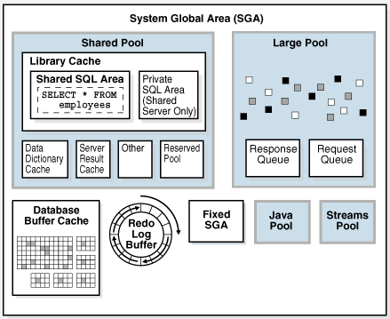
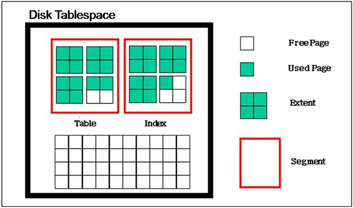
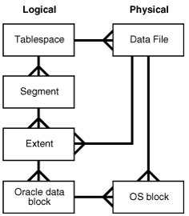
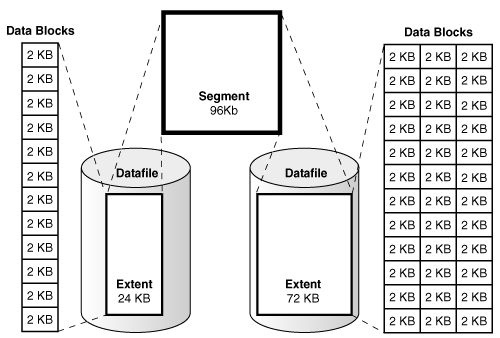
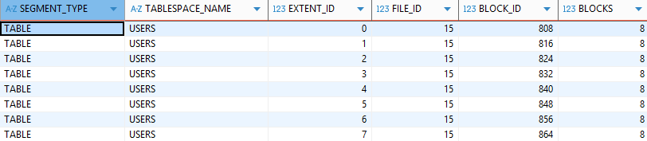
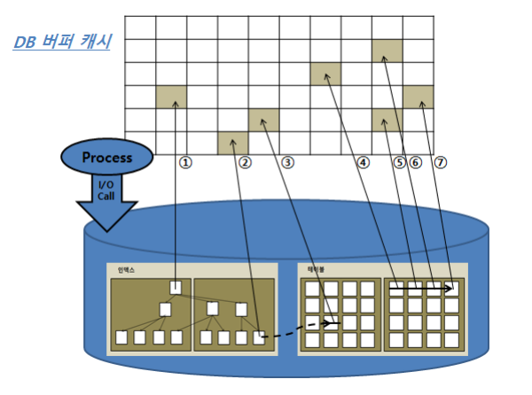
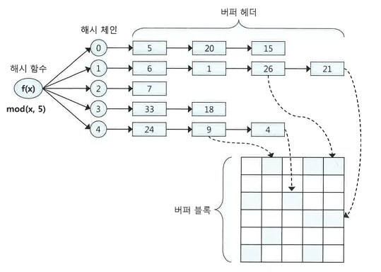

# 1장. SQL 처리 과정과 I/O

- 참고
  - https://docs.oracle.com/cd/E18283_01/server.112/e16508/logical.htm#insertedID0
  - https://docs.oracle.com/cd/E18283_01/server.112/e16508/startup.htm#g12154

## 1.1 SQL 파싱과 최적화

- 학습 목표
  - 옵티마이저가 SQL을 처리하는 과정

### 1.1.1 구조적,집합적,선언적 질의 언어

- 데이터 준비

```
-- 부서 테이블
CREATE TABLE dept (
    deptno NUMBER(10) PRIMARY KEY,
    dname VARCHAR2(20),
    loc VARCHAR2(20)
);

-- 사원 테이블
CREATE TABLE emp (
    empno NUMBER(10) PRIMARY KEY,
    ename VARCHAR2(20),
    job VARCHAR2(20),
    deptno NUMBER(10),
    CONSTRAINT fk_emp_dept FOREIGN KEY (deptno) REFERENCES dept(deptno)
);

-- 부서 데이터 입력
INSERT INTO dept (deptno, dname, loc) VALUES (10, 'ACCOUNTING', 'NEW YORK');
INSERT INTO dept (deptno, dname, loc) VALUES (20, 'RESEARCH', 'DALLAS');
INSERT INTO dept (deptno, dname, loc) VALUES (30, 'SALES', 'CHICAGO');
INSERT INTO dept (deptno, dname, loc) VALUES (40, 'OPERATIONS', 'BOSTON');

-- 사원 데이터 입력
INSERT INTO emp (empno, ename, job, deptno) VALUES (7369, 'SMITH',  'CLERK',     20);
INSERT INTO emp (empno, ename, job, deptno) VALUES (7499, 'ALLEN',  'SALESMAN',  30);
INSERT INTO emp (empno, ename, job, deptno) VALUES (7521, 'WARD',   'SALESMAN',  30);
INSERT INTO emp (empno, ename, job, deptno) VALUES (7566, 'JONES',  'MANAGER',   20);
INSERT INTO emp (empno, ename, job, deptno) VALUES (7654, 'MARTIN', 'SALESMAN',  30);
INSERT INTO emp (empno, ename, job, deptno) VALUES (7698, 'BLAKE',  'MANAGER',   30);
INSERT INTO emp (empno, ename, job, deptno) VALUES (7782, 'CLARK',  'MANAGER',   10);
INSERT INTO emp (empno, ename, job, deptno) VALUES (7788, 'SCOTT',  'ANALYST',   20);
INSERT INTO emp (empno, ename, job, deptno) VALUES (7839, 'KING',   'PRESIDENT', 10);
INSERT INTO emp (empno, ename, job, deptno) VALUES (7844, 'TURNER', 'SALESMAN',  30);
INSERT INTO emp (empno, ename, job, deptno) VALUES (7876, 'ADAMS',  'CLERK',     20);
INSERT INTO emp (empno, ename, job, deptno) VALUES (7900, 'JAMES',  'CLERK',     30);
INSERT INTO emp (empno, ename, job, deptno) VALUES (7902, 'FORD',   'ANALYST',   20);
INSERT INTO emp (empno, ename, job, deptno) VALUES (7934, 'MILLER', 'CLERK',     10);

```

#### SQL(Structured Query Language)

- 구조적 질의 언어
- 특징
  - structured
  - set-based
  - declarative

#### SQL 옵티마이저

- 프로시저를 만들어 내는 DBMS 내부 엔진
- 사용자 --SQL--> 옵티마이저 --실행계획--> 프로시저

### 1.1.2 SQL 최적화

- 세부 과정

* SQL 파싱
  - SQL 파서 담당
  - 파싱 트리 생성 -> Syntax 체크 -> Semantic 체크
* SQL 최적화
  - 옵티마이저 담당
  - 미리 수집한 시스템 및 오브젝트 통계정보 보유
  - 다양한 실행경로를 생성해서 가장 효율적인 경로 선택
* 로우 소스 생성
  - 로우 소스 생성기
  - 실행 가능한 코드 또는 프로시저 형태로 포맷팅

### 1.1.3 SQL 옵티마이저

- 최적화 단계
  - 실행계회 후보군 -> 오브젝트/시스템 통계정보를 이용해 예상비용 산정 -> 최저 비용 실행계획 선택

### 1.1.4 실행계획과 비용

- 실행계획 테스트 준비 및 설정

```
CREATE TABLE t
AS
SELECT d.no, e.*
FROM emp e
    , (SELECT rownum no from dual connect by level <= 1000) d;

create index t_x01 on t(deptno, no);
create index t_x02 on t(deptno, job, no);

# 기본 조회
EXPLAIN PLAN FOR
select * from t
where deptno = 10
and no = 1;

# index 지정
EXPLAIN PLAN FOR
select /*+ index(t t_x02) */ * from t
where deptno = 10
and no = 1;

# Table Full Scan 으로 변경
EXPLAIN PLAN FOR
select /*+full(t) */ * from t
where deptno = 10
and no = 1;

-- 실행계획 조회
SELECT * FROM TABLE(DBMS_XPLAN.DISPLAY);
```

### 1.1.5 옵티마이저 힌트

#### 주석 기호에 '+' 붙이기

```
SELECT /*+ INDEX(A 고객_PK) */
    고객명, ~~
FROM 고객 A
WHERE 고객ID = '0008'
```

#### 주의사항

- 힌트 안에 인자를 나열할때 ','를 사용할 수 있지만 힌트와 힌트 사이에 사용하면 안 됨

```
/*+ INDEX(A A_X01) INDEX(B, B_X03) */  -> 모두 유효
/*+ INDEX(C), FULL(D) */  -> 첫번째 힌트만 유효
```

- 테이블을 지정할 때 스키마명까지 명시하면 안 됨

```
SELECT /*+ FULL(SCOTT.EMP) */ -> 무효
  FROM EMP
```

- FROM 절 테이블 옆에 ALIAS를 지정했다면 힌트에도 반드시 ALIAS를 사용해야 함

```
SELECT /*+ FULL(EMP) */ -> 무효
  FROM EMP E
```

#### 자율 vs 강제

- SQL 옵티마이저에게 일부만 지시 가능

```
# 주문일자 컬럼이 선두인 인덱스 사용
# 조인 방식과 순서, 고객 테이블 액세스 방식은 옵티마이저 판단
SELECT /*+ INDEX(A (주문일자)) */
    A.주문번호, A.주문금액, B.고객명, B.주소
  FROM 주문 A, 고객 B
 WHERE A.주문일자 = :ORD_DT
   AND A.고객ID = B.고객ID
```

- 빈틈없는 지정

```
SELECT /*+ LEADING(A) USE_NL(B) INDEX(A (주문일자)) INDEX(B 고객_PK) */
    A.주문번호, A.주문금액, B.고객명, B.주소
  FROM 주문 A, 고객 B
 WHERE A.주문일자 = :ORD_DT
   AND A.고객ID = B.고객ID
```

- 힌트를 사용할 예정이면 빈틈없이 기술

### 자주 사용하는 Oracle SQL 힌트 목록

| 분류            | 힌트             | 설명                                                                   |
| --------------- | ---------------- | ---------------------------------------------------------------------- |
| 최적화 목표     | ALL_ROWS         | 전체 처리속도 최적화                                                   |
|                 | FIRST_ROWS(N)    | 최초 N건 응답속도 최적화                                               |
| 액세스 방식     | FULL             | Table Full Scan으로 유도                                               |
|                 | INDEX            | Index Scan으로 유도                                                    |
|                 | INDEX_DESC       | Index를 역순으로 스캔하도록 유도                                       |
|                 | INDEX_FFS        | Index Fast Full Scan으로 유도                                          |
|                 | INDEX_SS         | Index Skip Scan으로 유도                                               |
| 조인순서        | ORDERED          | FROM 절에 나열된 순서대로 조인                                         |
|                 | LEADING          | LEADING 힌트 끝에 기술한 순서대로 조인 (예: LEADING(T1 T2))            |
|                 | SWAP_JOIN_INPUTS | 해시 조인 시, BUILD INPUT을 명시적으로 선택 (예: SWAP_JOIN_INPUTS(T1)) |
| 조인방식        | USE_NL           | NL 조인으로 유도                                                       |
|                 | USE_MERGE        | 소트 머지 조인으로 유도                                                |
|                 | USE_HASH         | 해시 조인으로 유도                                                     |
|                 | NL_SJ            | NL 세미조인으로 유도                                                   |
|                 | MERGE_SJ         | 소트 머지 세미조인으로 유도                                            |
|                 | HASH_SJ          | 해시 세미조인으로 유도                                                 |
| 서브쿼리 팩토링 | MATERIALIZE      | WITH문 정의 집합을 물리적으로 생성                                     |
|                 | INLINE           | WITH문 정의 집합을 물리적으로 생성하지 않고 INLINE 처리하도록 유도     |
| 쿼리 변환       | MERGE            | 뷰 머지 유도                                                           |
|                 | NO_MERGE         | 뷰 머지 억지                                                           |
|                 | UNNEST           | 서브쿼리 Unnesting 유도                                                |
|                 | NO_UNNEST        | 서브쿼리 Unnesting 억제                                                |
|                 | PUSH_PRED        | 조인조건 Pushdown 유도                                                 |
|                 | NO_PUSH_PRED     | 조인조건 Pushdown 억제                                                 |
|                 | USE_CONCAT       | OR 또는 IN-List 조건을 OR-Expansion으로 확장 유도                      |
|                 | NO_EXPAND        | OR 또는 IN-List 조건을 OR-Expansion으로 확장 금지                      |
| 병렬 처리       | PARALLEL         | 테이블 스캔 또는 DML을 병렬적으로 처리하도록 유도 (예: PARALLEL(T1 2)) |
|                 | PARALLEL_INDEX   | 인덱스 스캔을 병렬적으로 처리하도록 유도                               |
|                 | PQ_DISTRIBUTE    | 병렬 수행 시 데이터 분할 방식 (예: PQ_DISTRIBUTE(HASH HASH))           |
| 기타            | APPEND           | Direct-Path Insert                                                     |
|                 | DRIVING_SITE     | DB link Remote 쿼리에 대한 최적화 실행장(Local 또는 Remote)            |
|                 | PUSH_SUBQ        | 서브쿼리를 푸쉬 처리되도록 유도                                        |
|                 | NO_PUSH_SUBQ     | 서브쿼리를 푸쉬되지 않도록 유도                                        |

## 1.2 SQL 공유 및 재사용

- 학습 목표
  - 소프트 파싱과 하드 파싱의 차이점
  - 바인드 변수의 중요성

### 1.2.1 소프트 파싱 vs. 하드 파싱

- SGA(System Global Area)
  - 데이터와 제어 구조를 캐싱하는 메모리 공간
  - 
- 사용자가 SQL문을 전달하면 DBMS는 SQL을 파싱한 후 `라이브러리 캐시`에 존재 확인
- 소프트 파싱
  - 라이브러리 캐시에서 찾아 곧바로 실행단계로 넘어가는 것
- 하드 파싱
  - 라이브러리 캐시에서 찾는 것을 실패해 최적화 및 로우 소스 생성 단계까지 모두 거치는 것

### 1.2.2 바인드 변수의 중요성

- 전체 SQL 텍스트가 이름 역할
  - 텍스트 중 일부가 수정되면 그 순간 다른 객체로 인식
  - 바인드 변수를 사용 안 할 경우 과도한 I/O 발생
- 바인드 변수
  - 파라미터 Driven 방식으로 SQL을 작성하는 방법

```
public void login(String loginId) {
    String sqlStmt = "SELECT * FROM CUSTOMER WHERE LOGIN_ID=?";
    PreparedStatement st = con.prepareStatement(sqlStmt);;
    st.setString(1, loginId);
    ResultSet rs = st.executeQuery();
    if(rs.next()) {
        // do anything
    }
    rs.close();
    st.close();
}
```

## 1.3 데이터 저장 구조 및 I/O 메커니즘

### 1.3.1 SQL이 느린 이유

- 대부분 디스크 I/O로 느려짐

### 1.3.2 데이터베이스 저장 구조

- 논리/물리 저장 구조
  - 
  - 블록 : 데이터를 읽고 쓰는 단위
  - 익스텐트 : 공간을 확장하는 단위, 연속된 블록 집합
  - 세그먼트 : 데이터 저장공간이 필요한 오브젝트(테이블, 인덱스, 파티션, LOB 등)
  - 테이블스페이스 : 세그먼트를 담는 컨테이너
  - 데이터파일 : 디스크 상의 물리적인 OS 파일
  - 
- 테이블스페이스 내 Segments, Extents, Data Blocks

  - 
  - 확인 쿼리

  ```
  select segment_type, tablespace_name, extent_id, file_id, block_id, blocks
  from dba_extents
  where owner = USER
  and segment_name = 'T'
  order by extent_id
  ```

  - segments 조회 결과

    - 
    - DBA(Data Block Address)
      - 모든 데이터 블록은 디스크 상에서 몇 번 데이터파일의 몇 번째 블록인지 나타내는 자신만의 고유값을 가짐
      - 데이터를 읽으려면 DBA부터 확인해야함
      - 인덱스를 이용할 경우
        - 인덱스 ROWID 이용
        - `DBA + 로우 번호`로 구성
      - 테이블을 스캔할 경우
        - 테이블 세그먼트 헤더에 저장된 익스텐트 맵을 이용

### 1.3.3 블록 단위/IO

- 특정 레코드 하나를 읽고 싶어도 해당 블록을 통째로 읽음
- 블록 사이즈 확인

```
SELECT value FROM v$parameter WHERE name = 'db_block_size';
```

### 1.3.4 시퀀셜 액세스 vs. 랜덤 액세스

- 테이블 또는 인덱스 블록을 액세스 하는 방식
  - 시퀀셜 액세스
    - 논리적/물리적으로 연결된 순서에 따라 차례대로 블록 읽는 방식
    - 인덱스 리프 블록은 앞뒤를 가리키는 주소값을 통해 논리적으로 연결
    - 테이블 블록간에는 서로 논리적인 연결고리를 갖고 있지 않음
    - 테이블은 어떻게 시퀀셜하게 접근할 수 있을까?
      - 세그먼트에 할당된 익스텐트 목록을 세그먼트 헤더에 맵으로 관리
      - 익스텐트 맵은 각 익스텐트의 첫 번째 블록 주소 값을 관리
  - 랜덤 액세스
    - 논리적/물리적 순서를 따르지 않고, 레코드 하나를 읽기 위해 한 블록씩 접근

### 1.3.5 논리적 I/O vs. 물리적 I/O

- 시스템 글로벌 영역(SGA)
  - 
  - 라이브러리 캐시
    - SQL과 실행계획, DB 저장형 함수/프로시저 등을 캐시
    - 코드 캐시
  - DB 버퍼캐시
    - 데이터 캐시
    - 디스크에서 읽은 데이터블록을 캐싱
- 논리적 I/O
  - SQL을 수행하면서 읽은 총 블록 I/O
- 물리적 I/O
  - 디스크에서 발생한 총 블록 I/O
- 버퍼해시 히트율(Buffer Cache Hit Ratio, BCHR)

```
BHCR = ( 캐시에서 곧바로 찾은 블록 수 / 총 읽은 블록 수 ) × 100
        = ( ( 논리적 I/O - 물리적 I/O ) / 논리적 I/O ) × 100
        = ( 1 - ( 물리적 I/O ) / (논리적 I/O ) ) × 100
```

- 읽은 전체 블록 중에서 물리적인 디스크 I/O를 수반하지 않고 메모리에서 찾은 비율
- 논리적 I/O가 정해졌을 때 물리적 I/O는 BCHR에 의해 결정
- BCHR은 외생 변수이므로 물리적 I/O는 논리적 I/O에 따라 결정
- SQL 성능을 높이기 위해서는 논리적 I/O를 줄여야 함
- SQL을 튜닝해서 읽는 총 블록 개수를 줄이면 됨
- SQL 튜닝
  - 논리적 I/O를 줄임으로써 물리적 I/O를 줄이는 것

### 1.3.6 Single Block I/O vs. Multiblock I/O

- Single Block I/O
  - 한 번에 한 블록씩 요청해서 메모리에 적재하는 방식
- Multiblock I/O
  - 한 번에 여러 블록씩 요청해서 메모리에 적재하는 방식
- 인덱스를 이용하는 방식은 Single Block I/O 방식
  - 인덱스 루트 블록을 읽을 때
  - 인덱스 루트 블록에서 얻은 주소 정보로 브랜치 블록을 읽을 때
  - 인덱스 브랜치 블록에서 얻은 주소 정보로 리프 블록을 읽을 때
  - 인덱스 리프 블록에서 얻은 주소 정보로 테이블 블록을 읽을 때
  - 
- 테이블 전체를 스캔할 때에는 Multiblock I/O 방식
  - 읽고자 하는 블록이 DB 버퍼캐시에 없을 경우 프로세스는 대기 큐에서 잠을 잠
  - 한꺼번에 많은 양을 요청해서 잠자는 횟수를 줄일 수 있음
  - 디스크 상에 그 불록과 인접한 블록(같은 익스텐트에 속한 블록)들을 한꺼번에 읽어 캐시에 미리 적재
  - 일반적으로 OS I/O 단위는 1MB
  - 오라클 레벨 I/O 단위가 8KB일 경우 128개의 블록을 담을 수 있음
  ```
  # 멀티 블록 읽기 수
  show parameter db_file_multiblock_read_count
  ```

### 1.3.7 Table Full Scan vs. Index Range Scan

- 테이블에 저장된 데이터를 읽는 방식은 두가지
  - 테이블 전체 스캔(Table Full Scan)
    - 테이블에 속한 모든 블록을 읽어서 사용자가 원하는 데이터를 찾는 방식
    - 시퀀셜 엑세스와 Multiblock I/O 방식
  - 인덱스를 이용한 테이블 엑세스(Index Range Scan)
    - 인덱스에서 일정량을 스캔하면서 얻은 ROWID로 테이블 레코드를 찾아가는 방식
    - ROWID는 테이블 레코드가 디스크 상 어디에 저장됐는지를 나타내는 위치 정보
    - 랜덤 엑세스와 Single Block I/O 방식
  - 보통은 인덱스를 이용한 테이블 엑세스 선호
  - 집계용 SQL과 배치 프로그램에서는 `테이블 전체 스캔` 검토
  - 큰 테이블에서 소량 데이터를 검색할 경우에는 `인덱스를 이용한 테이블 엑세스` 검토
  - 일정 카디널러티를 넘어서는 경우에는 `테이블 전체 스캔` 검토

### 1.3.8 캐시 탐색 메커니즘

- DBMS는 버퍼캐시를 해시 구조로 관리
  - 
  - 같은 입력 값은 항상 동일한 해시 체인에 연결됨
  - 다른 입력 값이 동일한 해시 체인에 연결될 수 있음
  - 해시 체인 내에서는 정렬이 보장되지 않음
- 메모리 공유자원에 대한 액세스 직렬화
  - 버퍼캐시는 공유 자원이므로 접근에 대한 제어 필요
  - 캐시버퍼 체인 래치, 캐시버퍼 LRU 체인 래치, 버퍼Lock 등 존재
  - 직렬화 메커니즘에 의한 캐시 경합을 줄이려면, SQL 튜닝을 통해 논리적 I/O를 줄여야 함
