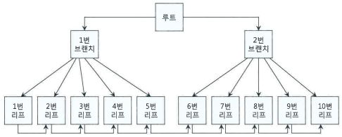

# 2장. 인덱스 기본

## 2.1 인덱스 구조 및 탐색

### 2.1.1 미리 보는 인덱스 튜닝

- 테이블에서 데이터를 찾는 방법
  - 테이블 전체 스캔
  - 인덱스 이용
- 인덱스
  - 큰 테이블에서 소량 데이터를 검색할 때 사용
- 인덱스 튜닝
  - 인덱스 스캔 효율화 튜닝
  - 랜덤 엑세스 최소화 튜닝(테이블 엑세스 횟수 줄이기)
- **SQL 튜닝은 랜덤 I/O와의 전쟁**
  - 

### 2.1.2 인덱스 구조

- 인덱스
  - 필요한 데이터만 빠르게 효율적으로 엑세스하기 위해 사용하는 오브젝트
  - B\*Tree 인덱스 사용
    - 
    - LMC(Leftmost Child)
      - 루트와 브랜치 블록에 있으며 키값을 갖지 않는 특별한 레코드
      - 자식 노드 중 가장 왼쪽 끝에 위치한 블록을 가리킴
      - LMC가 가리키는 주소로 찾아간 블록에는 키값을 가진 첫번째 레코드보다 작거나 같은 레코드 저장
    - 리프 블록
      - 키값 순으로 정렬
      - 테이블 레코드를 가리키는 주소값(ROWID)을 갖고 있음
- ROWID
  - ROWID = 데이터 오브젝트 번호 + 테이터 블록 주소(DBA, Data Block Address) + 로우 번호
  - 데이터 오브젝트 번호 = 세그먼트, 테이블 클러스터 번호
  - 데이터 블록 주소 = 데이터 파일 번호 + 블록 번호
  - 블록 번호 : 데이터파일 내에서 부여한 상대적 순번
  - 로우 번호 : 블록 내 순번
- 인덱스 탐색 과정
  - 수직적 탐색 : 인덱스 스캔 시작지점을 찾는 과정
  - 수평적 탐색 : 데이터를 찾는 과정

### 2.1.3 인덱스 수직적 탐색

- 인덱스 시작지점을 찾는 과정
  - 루트 블록 -> 브랜치 블록 ... 브랜치 블록 -> 리프 블록
  - 찾고자 하는 값보다 크거나 같은 값을 만나면, 바로 직전 레코드가 가리키는 하위 블록으로 이동
  - **조건을 만족하는 첫 번째 레코드**를 찾는 과정

### 2.1.4 인덱스 수평적 탐색

- 데이터를 찾는 과정
  - 인덱스 리프 블록끼리는 양방향 연결 리스트 구조로 앞뒤 블록에 대한 주소값을 갖음
- 인덱스를 수평적으로 탐색하는 이유
  - 조건절을 만족하는 데이터를 모두 찾기 위해서
  - ROWID를 얻기 위해서

### 2.1.5 결합 인덱스 구조와 탐색

- 두 개 이상 컬럼을 결합해서 인덱스를 만들 수 있음
  - 
- 인덱스 컬럼 순서 변경하여도 '=' 조건으로 검색할 때는 성능이 같음(블록 I/O 개수 같음)

## 2.2 인덱스 기본 사용법

### 2.2.1 인덱스를 사용한다는 것

- 찾고자 하는 값으로 정렬되어 있음(값들이 서로 모여 있음)
- **인덱스를 정상적으로 사용한다**의 의미
  - 리프 블록에서 스캔 시작점을 찾아 스캔하고 중간에 멈추는 것
  - Index Range Scan 방식
- 가공한 값이나 중간값(중간에 포함된 값)으로 스캔시
  - 시작점을 찾을 수 없음
  - 스캔하다가 중간에 멈출 수 없음
  - 찾고자 하는 값들이 흩어져 있음
  - 전체를 스캔해야 함
  - Index Full Scan 방식

### 2.2.2 인덱스를 Range Scan 할 수 없는 이유

- 인덱스 스캔 시작점을 찾을 수 없기 때문
- Index Range Scan하려면 **시작점**과 **끝지점**이 있어야 함
- Index Range Scan을 사용하는 예시

```
/* 가공 값 */
where substr(생년월일, 5, 2) = '05'
/* 중간 값 */
where 업체명 like '%대한%'
/* OR 연산 */
where (전화번호 = :tel_no OR 고객명 = :cust_nm)
```

- OR Expansion
  - 힌트를 통해 옵티마이저가 Index Range Scan을 사용하도록 변경

```
select /*+use_concat */ * from 고객
where (전화번호 = :tel_no OR 고객명 = :cust_nm)

/* 실행계획에서 아래와 같은 효과를 보임 */
select *
from 고객
where 고객명 = :cust_nm  -- 고객명이 선두 컬럼인 인덱스 Range Scan
union all
select *
from 고객
where 전화번호 = :tel_no -- 전화번호가 선두 컬럼인 인덱스 Range Scan
and (고객명 <> :cust_nm or 고객명 is null)
```

- IN 조건절
  - IN-List Iterator 방식 사용
  - IN-List 개수만큼 Index Range Scan 반복
  - Union All로 변환한 것과 같은 효과를 얻음
- OR 또는 IN 조건절은 옵티마이저의 쿼리변환 기능을 통해 Index Range Scan으로 처리될 수 있음

### 2.2.3 더 중요한 인덱스 사용 조건

- 인덱스를 Range Scan 하기위한 조건
  - 인덱스 선두 컬럼이 조건절에 있어야 함
  - 인덱스 선두 컬럼이 가공되지 않은 상태로 조건절에 있으면 인덱스 Range Scan은 무조건 가능
- 인덱스를 탄다고 성능이 다 좋은 것은 아님
  - 인덱스 리프 블록에서 스캔하는 양을 따져봐야 함
  - e.g. 주문일자가 선두 인덱스 컬럼이고 조건을 만족하는 로우가 100만건일경우 두번째 인덱스 컬럼이 중간값이나 가공값이라면 인덱스의 효과가 반감
  - 3.3 인덱스 스캔 효율화에서 살펴볼 예정

### 2.2.4 인덱스를 이용한 소트 연산 생략

- 인덱스를 사용하면 결과집합은 인덱스의 순서에 따라 출력되고 ORDER BY가 있어도 정렬 연산을 수행하지 않음
- 인덱스 리프 블록은 양방향 리스트 구조이므로 내리차순 정렬도 SORT ORDER BY 연산이 없음
  - INDEX RANGE SCAN 단계에 DESCENDING 이라 표시됨

### 2.2.5 ORDER BY 절에서 컬럼 가공

- 명제 '인덱스 컬럼을 가공하면 인덱스를 정상적으로 사용할 수 없다'

  - 인덱스 컬럼은 조건절을 사용한 컬럼을 가리킴
  - ORDER BY 또는 SELECT-LIST에서 컬럼을 가공함으로 인해 인덱스를 사용할 수 없는 경우 발생

  ```
  인덱스 : 장비번호, 변경일자, 변경순번

  /* 아래와 같이 작성하면 실행계회에서 SORT ORDER BY 절이 표시됨 */
  SELECT *
  FROM 상태변경이력
  WHERE 장비번호 = 'C'
  ORDER BY 변경일자 || 변경순번

  =>

  /* 아래와 같이 변경하면 정렬연산 생략 가능 */
  SELECT *
  FROM 상태변경이력
  WHERE 장비번호 = 'C'
  ORDER BY 변경일자, 변경순번
  ```

- 아래 예제에서 SORT ORDER BY 연산이 나타난 이유는?

```
인덱스 : 주문일자, 주문번호
SELECT *
FROM (
    SELECT TO_CHAR(A.주문번호, 'FM000000') AS 주문번호, A.업체번호, A.주문번호
    FROM 주문 A
    WHERE A.주문일자 = :dt
    AND A.주문번호 > NVL(:next_ord_no, 0)
    ORDER BY 주문번호
)
```

- 가공된 주문번호 사용
- ORDER BY 에서 주문번호 대신 **A.주문번호**를 사용하면 SORT ORDER BY가 사라짐

```
SELECT *
FROM (
    SELECT TO_CHAR(A.주문번호, 'FM000000') AS 주문번호, A.업체번호, A.주문번호
    FROM 주문 A
    WHERE A.주문일자 = :dt
    AND A.주문번호 > NVL(:next_ord_no, 0)
    ORDER BY A.주문번호
)
```

### 2.2.6 SELECT-LIST에서 컬럼 가공

- 인덱스 정렬 순서를 따르면 최소값/최대값을 찾을 시 정렬 연산을 따로 수행하지 않음

```
인덱스 : 장비번호, 변경일자, 변경순번

/* 숫자값으로 바꾼 값 기준으로 MAX 변경순번을 요구했기 때문에 정렬 연상 생략 불가 */
SELECT NVL(MAX(TO_NUMBER(변경순번)), 0)
FROM 상태변경이력
WHERE 장비번호 = 'C'
AND 변경일자 = '20180316'

=>

/* MAX 변경순번을 찾은후 숫자로 변환했으면 정렬 생략 가능 */
SELECT NVL(TO_NUMBER(MAX(변경순번)), 0)
FROM 상태변경이력
WHERE 장비번호 = 'C'
AND 변경일자 = '20180316'
```

- 최종 변경일자에 최종 변경순번까지 출력하는 SQL
  ```
  SELECT 장비번호, 장비명, 상태코드
      , (SELECT MAX(변경일자)
          FROM 상태변경이력
          WHERE 장비번호 = P.장비번호) 최종변경일자
      , (SELECT MAX(변경순번)
          FROM 상태변경이력
          WHERE 장비번호 = P.장비번호
          AND 변경일자 = (SELECT MAX(변경일자)
                          FROM 상태변경이력
                          WHERE 장비번호 = P.장비번호)) 최종변경순번
  FROM 장비 P
  where 장비구분코드 = 'A001'
  ```
  - '상태변경이력' 테이블을 3번 읽음
  - 가공테이블을 이용한 튜닝(bad)
    ```
    SELECT 장비번호, 장비명, 상태코드
        , SUBSTR(최종이력, 1, 8) 최종변경일자
        , SUBSTR(최종이력, 9) 최종변경순번
    FROM (
        SELECT 장비번호, 장비명, 상태코드
            , (SELECT MAX(변경일자 || 변경순번)
                FROM 상태변경이력
                WHERE 장비번호 = P.장비번호) 최종이력
        FROM 장비 P
        WHERE 장비구분코드 = 'A001'
    )
    ```
    - 인덱스 컬럼을 가공했기 때문에 많은 블록을 읽음
- Top N 알고리즘에서 설명
- 5.3.4 이력 조회에서 소개

### 2.2.7 자동 형변환

- 숫자형 컬럼 기준으로 문자형 컬럼을 변환
- 날짜 포맷을 정확히 지정해 주는 코딩 습관 필요
  ```
  SELECT * FROM 고객
  WHERE 가입일자 = TO_DATE('01-JAN-2018', 'DD-MON-YYYY')
  ```
- LIKE 연산자일 경우 문자형 기준으로 숫자형 컬럼이 변환
- e.g. 사용자의 입력 옵션 처리에 활용할 경우

  ```
  -- SQL1 : 사용자가 계좌번호를 입력할 경우
  SELECT * FROM 거래
  WHERE 계좌번호 = :acnt_no
  AND 거래일자 between :trd_dt1 and :trd_dt2

  -- SQL2 : 사용자가 계좌번호를 입력 안 할 경우
  SELECT * FROM 거래
  WHERE 계좌번호 = :acnt_no거래일자 between :trd_dt1 and :trd_dt2
  ```

  - 위 SQL문을 개선하기 위해 `WHERE 계좌번호 LIKE :acnt_no || '%'`와 같이 사용시 LIKE연산자로 인해 문자열로 자동 형변환 발생
    - 인덱스 Range Scan 할 수 없음

- 자동 형변환은 효율뿐만 아니라 에러와 오류도 발생시키므로 주의해야 함
  - 인덱스 컬럼 기준으로 **반대편 컬럼 또는 값을 정확히 형변환** 해야함
  - TO_CHAR, TO_DATE, TO_NUMBER와 같은 형변환 활용
  - 성능은 함수 사용 여부보단 블록 I/O를 줄일수 있느냐 없느냐로 결정

## 2.3 인덱스 확장기능 사용법

### 2.3.1 Index Range Scan

- 인덱스 루트에서 리프 블록까지 수직적으로 탐색한 후 **필요한 범위(Range)만** 스캔
  - 

### 2.3.2 Index Full Scan

- 인덱스 리프 블록을 처음부터 끝까지 **수평적**으로 탐색하는 방식
  - 
- 인덱스 선두 컬럼이 조건절에 없으면 옵티마이저는 Table Full Scan 고려
  - 아주 일부만 테이블에 액세스 하는 상황이라면 옵티마이저는 Index Full Scan 방식 선택
  - 테이블의 대부분의 로우에 액세스 하는 상황이라면 Table Full Scan이 효율적

### 2.3.3 Index Unique Scan

- 수직적 탐색만으로 데이터를 찾는 스캔 방식
  - Unique 인덱스를 '='조건으로 탐색하는 경우에 작동
  - 

### 2.3.4 Index Skip Scan

- 인덱스 선두 컬럼을 조건절에 사용하지 않으면 옵티마이저는 기본적으로 Table Full Scan을 선택
  - I/O를 줄이거나 정렬된 결과를 쉽게 얻을수 있다고 판단되면 Index Full Scan을 사용하기도 함
- 인덱스 선두 컬럼이 조건절에 없어도 인덱스를 활용하는 새로운 스캔 방식
  - 루트 또는 브랜치 블록에서 읽은 컬럼 값 정보를 이용해 조건절에 부합하는 레코드를 포함할 가능성이 잇는 리프 블록만 액세스하는 스캔 방식
  - 인덱스 선두 컬럼의 Distinct Value 개수가 적고 후행 컬럼의 Distinct Value 개수가 많을때 유용
  - 선두 컬럼에 대한 조건절이 있고 중간 컬럼에 대한 조건절이 없는 경우에도 사용 가능
  - 선두 컬럼이 부동호, BETWEEN, LIKE 같은 범위검색 조건일 때도 사용 가능
  - `INDEX_SS` 힌트로 설정
  - 

### 2.3.5 Index Fast Full Scan

- Index Fast Full Scan이 Index Full Scan보다 빠른 이유
  - 논리적인 인덱스 트리 구조 무시
  - 인덱스 세그먼트 전체를 Multiblock I/O 방식으로 스캔
  - 인덱스 구조
    - 
  - Index Fast Full Scan 방식
    - 물리적 디스크에 저장된 순서대로 읽음
    - Multiblock I/O 방식
    - 결과집합이 인덱스 키 순서대로 정렬되지 않음
    - 사용한 컬럼이 모두 인덱스에 포함돼 있을때만 사용 가능
    - 

### 2.3.6 Index Range Scan Descending

- Index Range SCan과 동일한 스캔 방식
- 인덱스를 뒤에서부터 앞쪽으로 스캔
- 내림차순으로 정렬된 결과집합을 얻음
- 
