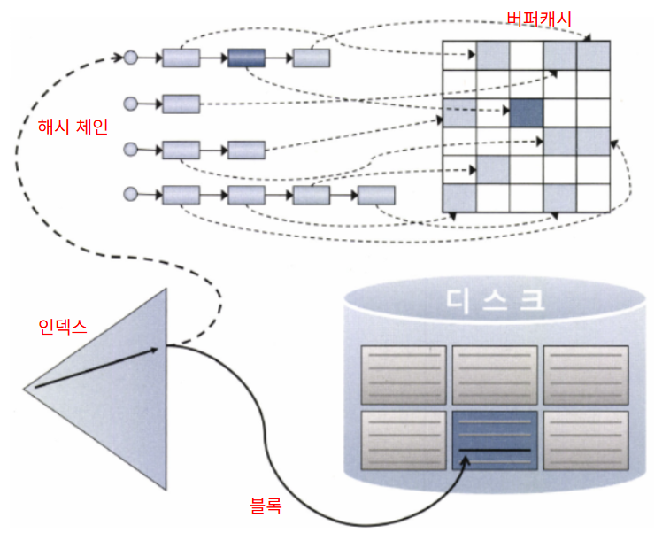
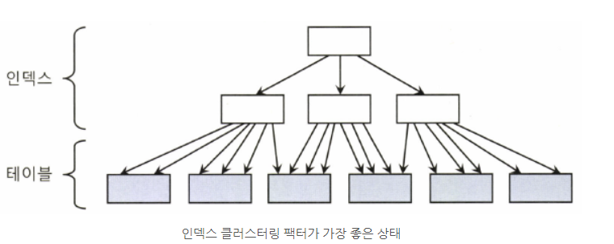
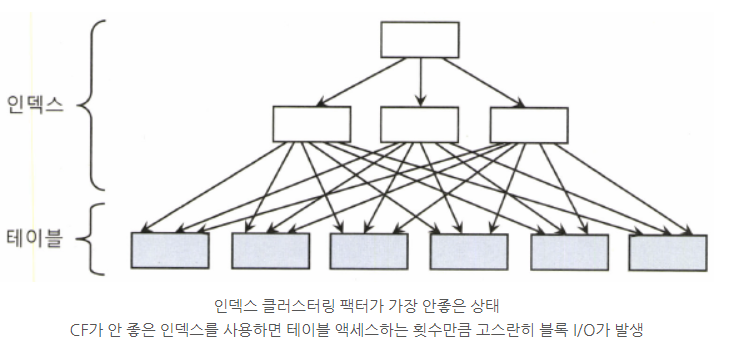
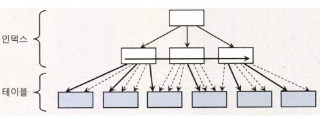
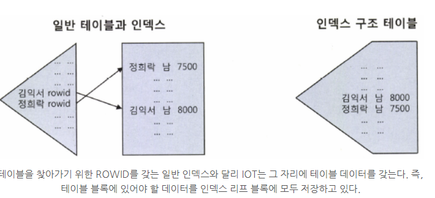
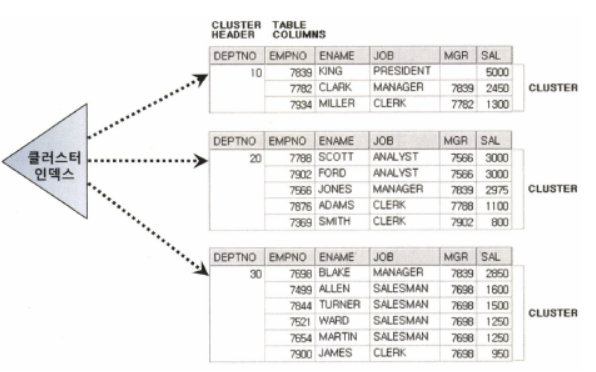
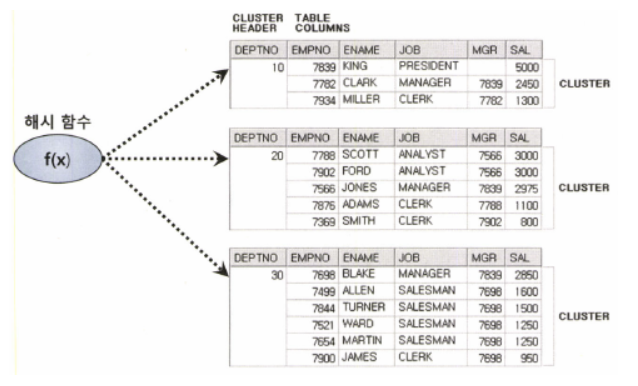

# 3장. 인덱스 튜닝

## 3.1 테이블 액세스 최소화

### 3.1.1 테이블 랜덤 엑세스

- 인덱스 ROWID는 논리적 주소
  - 디스크상에서 테이블 레코드를 찾아가기 위한 위치 정보를 담음
  - 테이블 레코드와 물리적으로 직접 연결된 구조 아님
  - 일반 DBMS에서 인덱스 ROWID를 이용한 테이블 액세스가 생각만큼 빠르지 않음
- I/O 매커니즘
  - 
  - 인덱스 ROWID가 가리키는 테이블 블록을 버퍼캐시에서 찾음
  - -> 못 찾을 경우 디스크에서 블록을 찾음
  - 모든 데이터가 캐싱되어 있어도 DBA 해싱과 래치 획득 과정을 반복해야 함

### 3.1.2 인덱스 클러스터링 팩터

- 클러스터링 팩터(Clustering Factor; CF)
  - 특정 컬럼을 기준으로 같은 값을 갖는 데이터가 서로 모여있는 정도
  - 인덱스 클러스터링 팩터가 좋은 상태
    - 
  - 인덱스 클러스터링 팩터가 좋은 상태
    - 
  - CF가 좋은 컬럼에 새성한 인덱스는 검색 효율이 좋음
    - 블록 I/O가 적게 발생
    - ** 버퍼 Pinning **
      - 래치 획득과 해시 체인 스캔 과정에서 얻은 테이블 블록에 대한 포인터를 유지
      - 다음 인덱스 레코드를 읽었을 때 같은 블록을 가리키면 테이블 블록을 바로 읽을 수 있음
      - 

### 3.1.3 인덱스 손익분기점

- Index Range Scan에 의한 테이블 액세스가 Table Full Scan보다 느려지는 지점
- Index Range Scan이 Table Full Scan보다 느려지는 이유
  - Table Full Scan은 **시퀀셜 액세스**, 인덱스 ROWID를 이용한 테이블 액세스는 **랜덤 액세스** 방식
  - Table Full Scan은 **Multiblock I/O**, 인덱스 ROWID를 이용한 테이블 액세스는 **Single Block I/O** 방식
- 데이터가 많으면 버퍼캐시 히트율은 떨어지므로 데이터가 많을 경우 인덱스 손익분기점은 낮아짐
- 온라인 프로그램 튜닝
  - 소량 데이터를 읽고 갱신
  - 인덱스를 효과적으로 활용하는 것이 중요
  - NL 방식 조인 사용
    - 인덱스를 이용하는 조인 방식
- 배치 프로그램 튜닝
  - 대량 데이터 처리
  - 전체범위 처리 기준으로 튜닝
  - Full Scan과 해시 조인 사용 고려
  - 초대용량의 경우에는 **파티션**을 활용한 병렬 처리 고려
    - 파티션을 하는 이유는 Full Scan을 빠르게 처리하기 위해

### 3.1.4 인덱스 컬럼 추가

- 인덱스 구성을 변경하기 어려움
  - 인덱스 관리의 어려움
- 기존 인덱스에 컬럼을 추가함으로써 테이블 액세스를 최소화
  - 테이블 랜덤 엑세스를 줄여줌

### 3.1.5 인덱스만 읽고 처리

- Covered 쿼리
  - 인덱스만 읽어서 처리하는 쿼리
- Covered 인덱스
  - Covered 쿼리에 사용한 인덱스
- Include 인덱스
  - SQL Server 2005 버전에 추가
  - 컬럼 1023개까지 지정 가능
  - 해당 컬럼은 리프 블록에만 저장
  - 해당 컬럼은 수평적 탐색에서만 적용됨

### 3.1.6 인덱스 구조 테이블

- IOT(Index-Organized Table)
  - 테이블을 인덱스 구조로 생성
  - 
  - 일반 테이블은 적재될때 랜덤 블록에 저장됨
  - IOT는 정렬되어 저장됨
  - 100% 정렬된 상태로 모여 있으므로 랜덤 액세스가 아닌 시퀀셜 방식으로 데이터 액세스
  - BETWEEN이나 부동호 조건으로 넓은 범위를 읽을 때 유리
  - 입력과 조회 패턴이 서로 다를 때, 주요 조회 패턴의 컬럼을 첫 번째 정렬 기준이되도록 구성시 효율 좋음

### 3.1.7 클러스터 테이블

- 클러스터 테이블 유형
  - 인덱스 클러스터
  - 해시 클러스터
- 인덱스 클러스터
  - 클러스터 키 값이 같은 레코드를 한 블록에 모아서 저장하는 구조
  - B\*Tree 인덱스 구조 사용
  - 테이블 레코드를 일일이 가리키지 않고 해당 키 값을 저장하는 첫 번째 데이터 블록을 가리킴
    - 인덱스 레코드는 테이블 레코드와 1:1 대응 관계
    - 인덱스 클러스터는 테이블 레코드와 1:M 대응 관계
    - 
    - 클러스터 인덱스의 키 값은 항상 Unique함
  - 다중 테이블 클러스터
    - 여러 테이블 레코드를 같은 블록에 저장
- 해시 클러스터
  - 인덱스를 사용하지 않고 해시 알고리즘을 사용해 클러스터를 찾아감
  - 

## 3.2 부분범위 처리 활용

### 3.2.1 부분범위 처리

- 사용자로부터 Fetch Call이 있을 때마다 일정량씩 나누어 전송하는 것
- OLTP 환경에서 대용량 데이터를 핸들링 할 수 있는 핵심 원리

```
1. 최초 rs.next() 호출 시 Fetch Call을 통해 DB 서버로부터 전송받은 데이터 10건을 클라이언트 캐시에 저장한다.
2. 이후 rs.next() 호출할 때는 Fetch Call을 발생시키지 않고 캐시에서 데이터를 읽는다.
3. 캐시에 저장한 데이터를 모두 소진한 상태에서 rs.next() 호출 시 추가 Fetch Call을 통해 10건을 전송받는다.
4. n건을 다 읽을 때까지 2~3번 과정을 반복한다.
```

- 클라이언트 캐시는 JDBC 드라이버가 애플리케이션(클라이언트) 측 메모리에 유지하는 임시 데이터 저장 공간
- 정렬 조건이 있을 때 부분범위 처리
  - 부분범위 처리 안됨, 전체범위 처리 됨
    - 정렬후 일정량씩 클라리언트에게 전달
  - 정렬 컬럼이 선두인 인덱스라면 부분범위 처리 가능
    - 인덱스 설정이 중요함
- Statement 객체의 setFetchSize 메소드를 통해 설정 변경 가능
- Array Size 조정을 통한 Fetch Call 최소화
  - 대량 데이터일 경우 최대한 크게 설정하여 Fetch Call 횟수를 줄일 수 있음

### 3.2.2 부분범위 처리 구현

- 전체 조회 구현

```
private void execute(Connection con) throws Exception{
 
    Statement stmt = con.createStatement();
    
    Result rs = stmt.executeQuery(“select name from big_table”);
    
    for(int i=0; i<100; i++){
        if(rs.next() System.out.println(rs.getString(1));
    }
 
    rs.close();
 
    stmt.close();
}
```

- 부분범위 처리 구현

```
// 부분범위 처리를 활용하여 ArraySize만큼만 읽음
public static int fetch(ResultSet rs, int arraySize) {
    int i = 0;
    while(rs.next()) {
        if(++i >= arraySize) return i;
    }
    return i;
}

public static void  execute(Connection con) throws Exception {
    int arraySize = 10;
    String SQLStmt = "select object_id, object_name from all_objects";
    Statement stmt = con. createStatement();
    stmt. setFetchSize(arraysize);
    ResultSet rs = stmt.executeQuery(SQLStmt);
    while(true){
        int r = fetch (rs, arraysize);
        if (r < arraySize) break;
        System.out .println (“ Enter to Continue ... (Q)uit? ");
        BufferedReader in = new BufferedReader(new InputStreamReader(System.in));
        String input = in.readLine();
        if(input.equals("Q")) break;
    }
    rs.close();
    stmt.close();
}
```

### 3.2.3 OLTP 환경에서 부분범위 처리에 의한 성능개선 원리

- OLTP; Online Transaction Processing
- 온라인 트랜잭션을 처리하는 시스템
  - 항상 정렬 상태를 유지하는 인덱스를 이용하면, 정렬 작업을 생략하고 앞쪽 일부 데이터를 빠르게 보여주는 것이 가능함
- 부분범위 처리는 멈출 수 있어야 의미 있음
