# 3장. 인덱스 튜닝

## 3.3 인덱스 스캔 효율화

### 3.3.1 인덱스 탐색

- 인덱스 탐색은 **수직적 탐색(vertical search)** 과 **수평적 탐색(horizontal search)** 으로 구분
- **수직적 탐색**: 트리 구조에서 루트 → 리프까지 내려가는 과정
- **수평적 탐색**: 리프 레벨에서 인접한 리프 블록들을 순차 탐색하는 과정
- 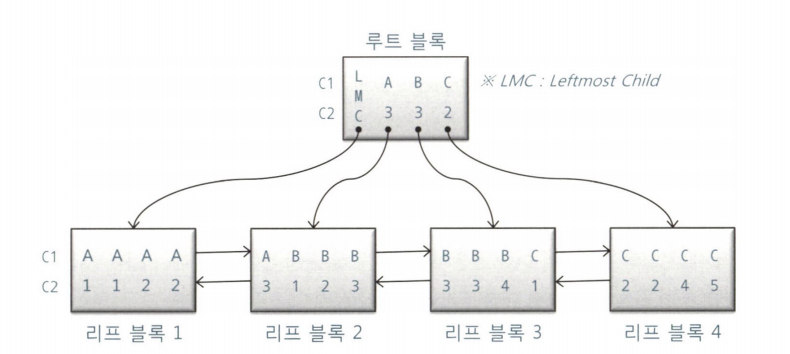
- 조건절 1
  ```
  WHERE C1 = 'B'
  ```
  - 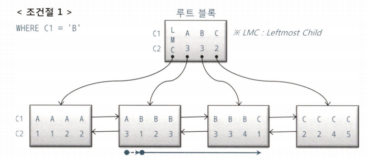
- 조건절 2
  ```
  WHERE C1 = 'B'
  AND C2 = 3
  ```
  - 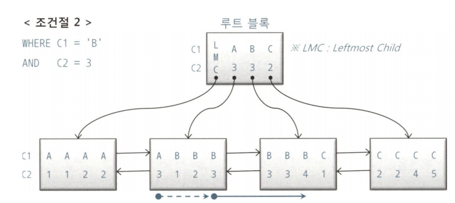
- 조건절 3
  ```
  WHERE C1 = 'B'
  AND C2 >= 3
  ```
  - 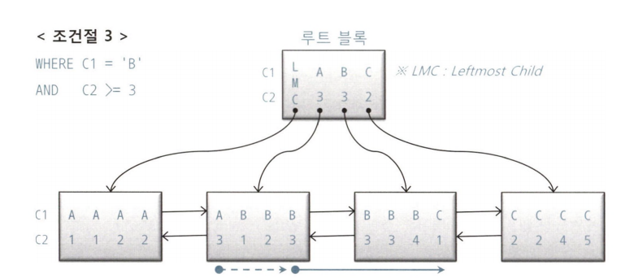
- 조건절 4
  ```
  WHERE C1 = 'B'
  AND C2 <= 3
  ```
  - 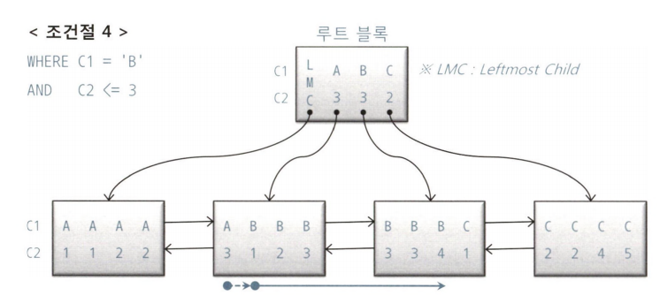
- 조건절 5
  ```
  WHERE C1 = 'B'
  AND C2 BETWEEN 2 AND 3
  ```
  - 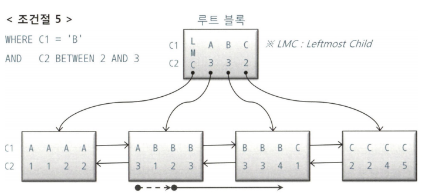
- 조건절 6
  ```
  WHERE C1 BETWEEN 'A' AND 'C'
  AND C2 BETWEEN 2 AND 3
  ```
  - 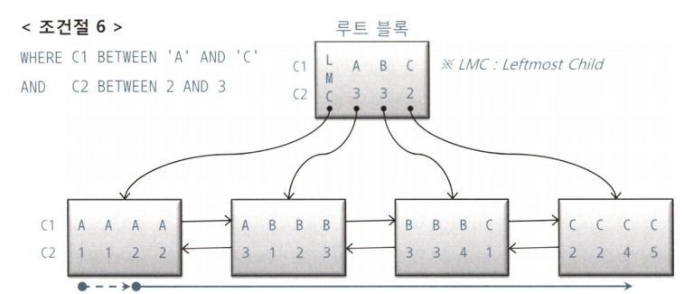
  - C2는 스캔량을 줄이는데 영향을 안 미침

### 3.3.2 인덱스 스캔 효율성

- 인덱스 선행 컬럼이 조건절에 없거나 `=` 조건이 아니면 인덱스 스캔 과정에서 비효율 발생
  - 선행 컬럼 : 어떤 컬럼 보다 **상대적으로 앞쪽**에 놓인 컬럼
  - 선두 컬럼 : 인덱스 구성상 **맨 앞쪽**에 있는 컬럼
  - 좌쿼리 : where c1 = '성' and c2 = '능' and c3 = '검'
  - 우쿼리 : where c1 = '성' and c2 = '능' and **c4 = '선'**
  - 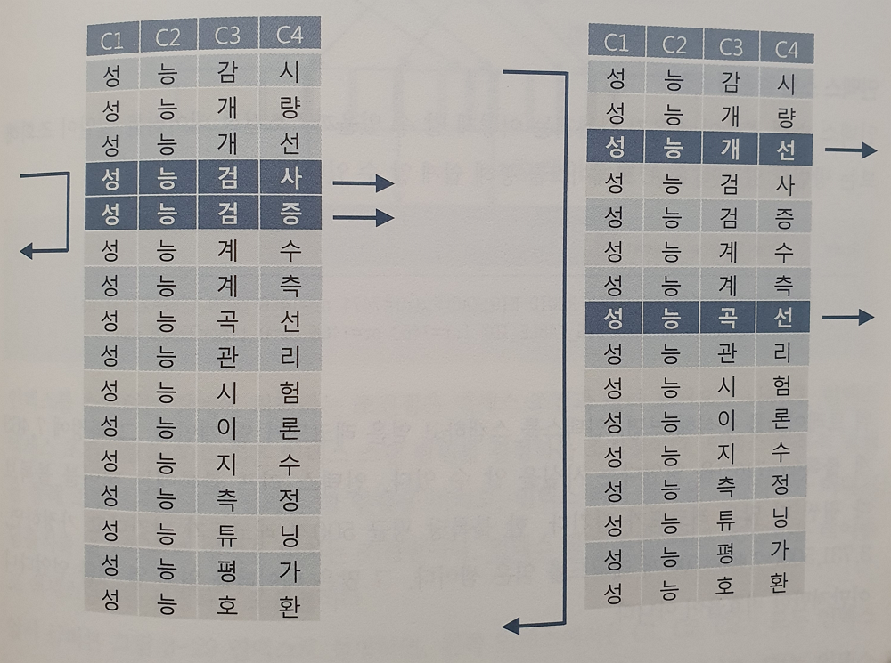

### 3.3.3 액세스 조건과 필터 조건

- 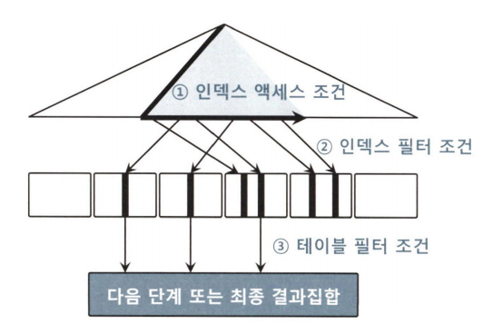
- **액세스 조건(Index Access Condition)**
  - 인덱스 스캔 범위를 결정하는 조건절
- **필터 조건(Filter Condition)**
  - 테이블로 액세스할지를 결정하는 조건절
- e.g. : where c1 = '성' and c2 = '능' and **c4 = '선'**
  - 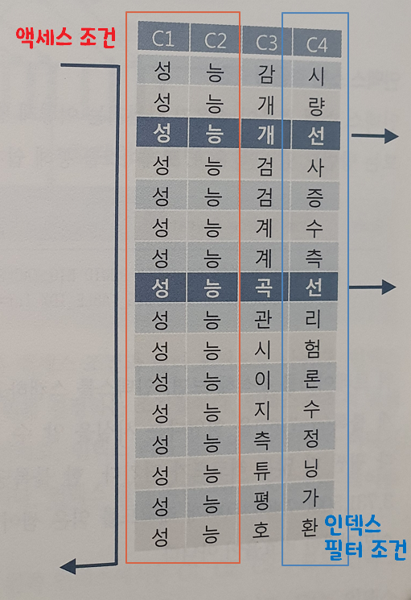
- 옵티마이저는 다음 비용을 합산하여 실행계획 선택
  ```
    인덱스 수직 탐색 비용 + 인덱스 수평 탐색 비용 + 테이블 랜덤 액세스 비용
    =  인덱스 루트와 브랜치 레벨에서 읽는 블록 수
    + 인덱스 리프 블록을 스캔하는 과정에 읽는 블록 수
    + 테이블 액세스 과정에 읽는 블록 수
  ```

### 3.3.4 비교 연산자 종류와 컬럼 순서에 따른 군집성

- 테이블과 달리 인덱스에는 **같은 값**을 갖는 레코드들이 서로 군집해 있음
- 인덱스 컬럼을 앞쪽부터 누락없이 `=` 연산자로 조회하면 조건절을 만족하는 레코드는 모두 모여 있음
- 인덱스 조건 하나를 누락하거나 `=` 조건이 아닌 연산자로 조회하면 조건절을 만족하는 레코드는 서로 흩어진 상태가 됨
- 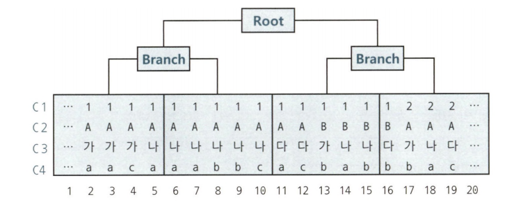
- e.g.

```sql
<조건절 1> where C1 = 1 and C2 = 'A' and C3 = '나' and C4 = 'a'
<조건절 2> where C1 = 1 and C2 = 'A' and C3 = '나' and C4 >= 'a'
<조건절 3> where C1 = 1 and C2 = 'A' and C3 between '가' and '다' and C4 = 'a'
<조건절 4> where C1 = 1 and C2 <= 'B' and C3 = '나' and C4 between 'a' and 'b'
<조건절 5> where C1 between 1 and 3 and C2 = 'A' and C3 = '나' and C4 = 'a'
```

- 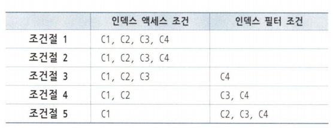

> 첫번째 나타나는 범위검색 조건까지가 인덱스 액세스 조건이고, 나머지는 필터 조건

### 3.3.5 인덱스 선행 컬럼이 등치(=) 조건이 아닐 때 생기는 비효율

- 인덱스 선행 컬럼이 조건절에 없거나 부등호, BETWEEN, LIKE 같은 범위검색 조건이면, 인덱스를 스캔하는 단계에서 비효율 발생
- e.g. 인덱스 : 인터넷매물 + 아파트시세코드 + 평형 + 평형타입

```sql
where 인터넷매물 between '1' and '3'
and 아파트시세코드='A01011350900056'
and 평형='59'
and 평형타입='A'
```

- 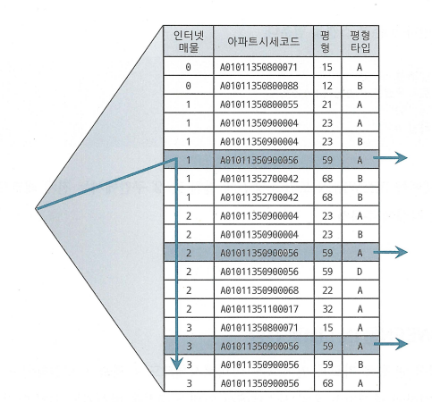

- 1과 3에서는 잘 멈췄지만 '2' 구간에서는 전체 레코드를 다 읽는 비효율 발생

### 3.3.6 BETWEEN을 IN-List로 전환

- `BETWEEN` 조건을 `IN-List` 형식으로 바꾸면 여러 번의 수직 탐색으로 효율 개선 가능

```sql
WHERE 인터넷매물 IN ('1', '2', '3')
  AND 아파트시세코드 = 'A0101'
  AND 평형 = '59'
  AND 평형타입 = 'A'
```

- 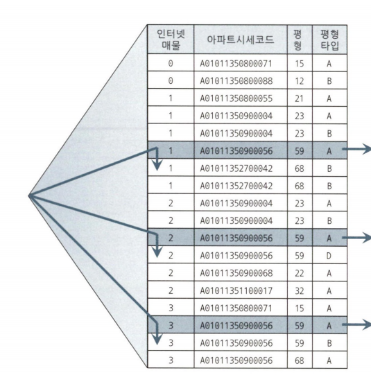
  - 수직적 탐색이 3번 일어남
- IN-List 항목 개수가 늘어날 경우
  - IN-List 값들을 코드 테이블로 관리하고 있다면 NL방식의 조인문이나 서브쿼리로 구현 가능
- BETWEEN 조건을 IN-List로 전환할 때 주의사항
  - IN-List 개수가 많은 경우 -> 수직탐색 발생
  - 인덱스 스캔 과정에 선택되는 레코드들이 서로 붙어있는 경우 -> 스캔해야하는 인덱스 블록이 소량이므로 효과 미미

### 3.3.7 Index Skip Scan 활용

- IN-List가 효율적이라 판단되는 상황에서 조건절을 바꾸지 않고도 같은 효과를 낼 수 있음

- 데이터 분포가 선행 컬럼 기준으로 균등하지 않을 때 특히 유용
- e.g. IN-List와 Index Skip Scan 비교

```sql
-- IN-List
select /*+ INDEX(...) */ count(*)
from 월별고객별판매집계 t
where 판매구분 = 'A'
and 판매월 in ('201801', '201802', '201803', '201804', '201805', '201806',
            '201807', '201808', '201809', '201810', '201811')

-- Index Skip Scan
select /*+ INDEX_SS(...) */ count(*)
from 월별고객별판매집계 t
where 판매구분 = 'A'
and 판매월 between '201801' and '201812'
```

### 3.3.8 IN 조건은 '='인가

- IN-List 조건이 항상 `=` 처럼 동작하지 않음

- 인덱스 구성 순서에 따라 액세스 조건이 되기도, 필터 조건이 되기도 함

- e.g. 인덱스 구성 순서에 따른 조회 조건 변경

  - 인덱스 [상품ID + 고객번호]

    - 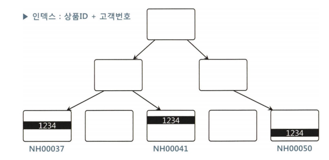
    - 상품ID가 선행이면 IN 조건이 액세스 조건 처리됨

  - 인덱스 [고객번호 + 상품ID]

    - 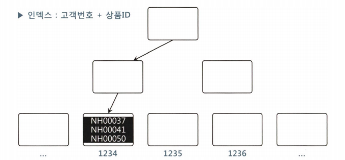
    - 고객번호가 선행이면 IN 조건이 필터 처리될 수 있음

- NUM_INDEX_KEYS 힌트를 이용한 액세스/필터 조건 유도
  - `/*+num_index_keys(a 고객별가입상품_x1 1) */` 고객별가입상품\_x1 인덱스의 첫번째 칼럼까지만 액세스 조건으로 사용

```sql
-- 필터 조건 유도 1
select /*+num_index_keys(a 고객별가입상품_x1 1) */ *
from 고객별가입상품 a
where 고객번호 = :cust_no
and 상품ID in ('NH00037', 'NH00041', 'NH00050')

-- 필터 조건 유도 2
select *
from 고객별가입상품 a
where 고객번호 = :cust_no
and RTRIM(상품ID) in ('NH00037', 'NH00041', 'NH00050')

-- 필터 조건 유도 3
select *
from 고객별가입상품 a
where 고객번호 = :cust_no
and 상품ID || '' in ('NH00037', 'NH00041', 'NH00050')

-- 인덱스 액세스 조건 유도
select /*+num_index_keys(a 고객별가입상품_x1 2) */ *
from 고객별가입상품 a
where 고객번호 = :cust_no
and 상품ID in ('NH00037', 'NH00041', 'NH00050')
```

### 3.3.9 BETWEEN과 LIKE 스캔 범위 비교

- **LIKE**보다 **BETWEEN**을 사용하는 게 나음
- e.g. LIKE vs BETWEEN

```sql
<조건절 1>
where 판매월 BETWEEN '201901' and '201912' and 판매구분 = 'B'
<조건절 2>
where 판매월 LIKE '2019%' and 판매구분 = 'B'
```

- 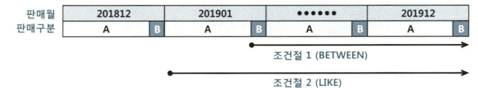
  - 201900이 있을수 있으므로 판매구분='B' 지점으로 바로 갈 수 없음

### 3.3.10 범위검색 조건을 남용할 때 생기는 비효율

- **LIKE** 조건을 남발하면 스캔 범위가 넓어져 비효율 발생
- e.g. `null` 체크를 하나의 쿼리로 만들기 위해 발생하는 비효율
- 나눠서 작성(효율적)

```sql
-- <쿼리1> 지역코드를 입력 할 경우
WHERE 회사코드 = :com
  AND 지역코드 = :reg
  AND 상품명 LIKE :prod || '%'

-- <쿼리2> 지역코드를 입력 안 할 경우
WHERE 회사코드 = :com
  AND 상품명 LIKE :prod || '%'
```

- 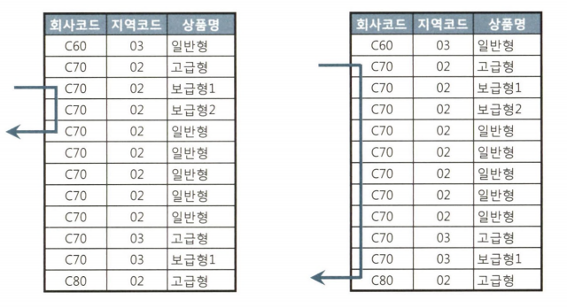

- 합쳐서 작성(비효율 발생)

```sql
WHERE 회사코드 = :com
  AND 지역코드 LIKE :reg || '%'
  AND 상품명 LIKE :prod || '%'
```

- 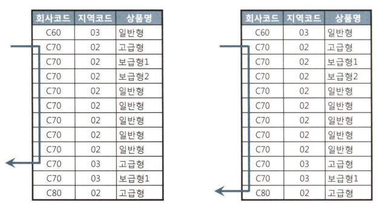

### 3.3.11 다양한 옵션 조건 처리 방식의 장단점 비교

- OR 조건 사용

  - 인덱스 액세스 조건으로 사용 불가
  - 인덱스 필터 조건으로도 사용 불가
  - `Not Null` 컬럼일 경우 인덱스 필터 조건으로 사용 가능
  - 테이블 필터 조건으로만 사용 가능

- LIKE / BETWEEN 조건 활용시 아래 사항에 해당된다면 사용 자제

  - 인덱스 선두 컬럼(LIKE / BETWEEN)
  - NULL 허용 컬럼(LIKE / BETWEEN)
  - 숫자형 컬럼(LIKE) <- 형변환 발생
  - 가변 길이 컬럼(LIKE)

- UNION ALL / NVL / DECODE 활용
  - 옵션 유무에 따라 SQL을 분기하거나 변환하는 방법

```sql
-- UNION ALL
SELECT … FROM 거래
WHERE :cust_id IS NULL
  AND 거래일자 BETWEEN :dt1 AND :dt2
UNION ALL
SELECT … FROM 거래
WHERE :cust_id IS NOT NULL
  AND 고객ID = :cust_id
  AND 거래일자 BETWEEN :dt1 AND :dt2;

-- NVL
WHERE 고객ID = nvl(:cust_id, 고객ID)
  AND 거래일자 BETWEEN :dt1 AND :dt2;

-- DECODE
WHERE 고객ID = decode(:cust_id, null, 고객ID, :cust_id)
  AND 거래일자 BETWEEN :dt1 AND :dt2;
```

### 3.3.12 함수 호출부하 해소를 위한 인덱스 구성

- PL/SQL이 느린 이유

  - 가상머신 상에서 실행되는 인터프리터 언어
  - 호출시마다 컨텍스트 스위칭 발생
  - 내장SQL에 대한 Recursive Call 발생
    ```sql
    select 회원번호, 회원명, 생년, 생월일, encryption(전화번호)
    from 회원
    where 생월일 like '01%'  -- 수십~수백만건 조회시 매건마다 Recursive Call 발생
    ```

- PL/SQL 대신 join문 고려

```sql
-- PL/SQL 사용
select 회원번호, GET_ADDR(우편번호) as 기본주소
from 회원
where 생월일 like '01%'

-- JOIN 사용
select a.회원번호
    , (select b.시도 || ' ' || b.구군 || ' ' || b.읍면동
        from  기본주소 b
        where b.우편번호 = a.우편번호 and b.순번=1) 기본주소
from 회원 a
where a.생월일 like '01%'

-- JOIN 사용2
select a.회원번호, b.시도 || ' ' || b.구군 || ' ' || b.읍면동 as 기본주소
from 회원 a, 기본주소 b
where a.생월일 like '01%'
and b.우편번호(+) = a.우편번호
and b.순번(+) = 1
```

- Full Scan 방식으로 조건절에서 PL/SQL 사용시 테이블 **건수**만큼 수행

```sql
select /*+ full(a) */ 회원번호
from 회원 a
where 암호화된_전화번호 = encryption( :phone_no )
```

- 필터 조건으로 사용시에는 만족하는 조건 결과만큼 실행

```sql
create index 회원_X02 on 회원(생년, 생월일, 암호화된_전화번호)

select /*+index(a 회원_X03) */ 회원번호
from 회원 a
where 생년 = '1987'
and 암호화된_전화번호 = encryption( :phone_no ) -- 생년='1987' 만족한 수만큼 실행
```

- 인덱스 액세스 조건으로 사용시에는 1번만 실행

```sql
create index 회원_X03 on 회원(생년, 암호화된_전화번호)

select /*+index(a 회원_X03) */ 회원번호
from 회원 a
where 생년 = '1987'
and 암호화된_전화번호 = encryption( :phone_no )
```

## 3.4 인덱스 설계

### 3.4.1 인덱스 설계가 어려운 이유

- 인덱스가 많으면 발생하는 문제

  - **DML 성능 저하**: TPS(Transaction Per Second) 감소
  - **데이터베이스 사이즈 증가**: 디스크 공간이 낭비
  - **데이터베이스 관리 및 운영 비용 상승**: 유지보수 부담

- 테이블에 인덱스가 여섯 개 달려 있으면,
  - 신규 데이터를 입력할 때마다 여섯 개 인덱스에도 데이터를 입력해야 함
  - 테이블과 달리 인덱스는 정렬 상태를 유지해야 하므로 수직적 탐색을 통해 블록을 찾아야 함
  - 데이터를 삭제할 때도 마찬가지로 여섯 개 인덱스에서 레코드를 일일이 찾아 지워줘야 함

### 3.4.2 가장 중요한 두 가지 선택 기준

- 인덱스 설계 시 가장 중요한 기준

  - **조건절 사용 빈도**: 조건절에 항상 사용하거나 자주 사용하는 컬럼 선정
  - **연산자 형태**: `=` 조건으로 자주 조회하는 컬럼을 앞쪽에 두어야 함

### 3.4.3 스캔 효율성 이외의 판단 기준

- 인덱스를 설계할 때 고려해야 할 추가 판단 기준

  - 수행빈도
  - 업무상 중요도
  - 클러스터링 팩터
  - 데이터량
  - DML 부하
  - 저장공간
  - 인덱스 관리 비용

- 이 중 **수행 빈도**가 가장 중요한 요소 중 하나

  - 자주 수행하지 않는 SQL이면 인덱스 스캔 과정에 약간의 비효율이 있어도 큰 문제가 아님
  - 수행빈도가 매우 높은 SQL에는 최적의 인덱스를 구성해줘함

- NL 조인에서는 Inner 쪽의 인덱스가 굉장히 중요
- 수행빈도가 매우 높은 SQL이라면 `=` 조건 컬럼을 선두에 두는 것이 중요
- 테이블 액세스 없이 인덱스에서 필터링을 마치도록 구성

- **데이터량**도 중요한 판단 기준
  - 데이터량이 적다면 굳이 인덱스를 많이 만들 필요가 없음
  - Full Scan으로 충분히 빠르기 때문

### 3.4.4 공식을 초월한 전략적 설계

- 인덱스를 설계할 때는 업무 상황을 이해하고 나름의 판단 기준을 가지고 결정을 내리는 것이 중요

- **실무 예시: 보험사 가계약 테이블**

- 가계약 목록을 조회할 때 다양한 방식이 사용되는 상황에서, 인덱스 스캔 효율을 위해 = 조건 컬럼을 앞에, BETWEEN 조건 컬럼을 뒤에 두려면 24개의 인덱스가 필요할 수 있음

  - 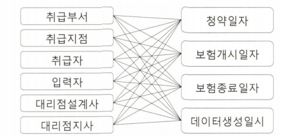

  - 일적으로 일자/일시 조건을 선두에 두고, 자주 사용하는 필터 조건은 모두 뒤쪽에 추가하는 방식으로 설계할 수 있음

  ```
  ● X01 : 청약일자 + 취급부서 + 취급지점 + 취급자 + 입력자 + 대리점설계사 + 대리점지사
  ● X02 : 보험개시일자 + 취급부서 + 취급지점 + 취급자 + 입력자 + 대리점설계사 + 대리점지사
  ● X03 : 보험종료일자 + 취급부서 + 취급지점 + 취급자 + 입력자 + 대리점설계사 + 대리점지사
  ● X04 : 데이터생성일시 + 취급부서 + 취급지점 + 취급자 + 대리점설계사 + 대리점지사
  ● X05 : 입력자 + 데이터생성일시
  ```

- **전략적 설계의 핵심**:

  - 일자 조회구간이 길지 않으면 인덱스 스캔 비효율이 성능에 미치는 영향이 크지 않음
  - 인덱스 스캔 효율보다 테이블 액세스가 더 큰 부하요소
  - 가계약은 주로 최근 3일 이내 데이터를 조회
  - 가장 많이 사용하는 패턴은 입력자 `=`, 데이터 생성일시 `BETWEEN` 조건
  - 입력자 + 데이터 생성일시 인덱스를 추가하여 전체 인덱스 개수를 5개로 줄일 수 있음

### 3.4.5 소트 연산을 생략하기 위한 컬럼 추가

- 인덱스는 항상 정렬 상태를 유지하므로 ORDER BY, GROUP BY를 위한 소트 연산을 생략할 수 있게 해줌
- 소트 연산을 생략할 목적으로 컬럼을 인덱스 구성에 포함시킴으로써 성능 개선을 도모할 수 있음

- **예제 쿼리**

```sql
SELECT 계약ID, 청약일자, 입력자ID, 계약상태코드, 보험시작일자, 보험종료일자
FROM 계약
WHERE 취급지점ID = :trt_brch_id
  AND 청약일자 BETWEEN :sbcp_dt1 AND :sbcp_dt2
  AND 입력일자 >= TRUNC(SYSDATE - 3)
  AND 계약상태코드 IN (:ctr_stat_cd1, :ctr_stat_cd2, :ctr_stat_cd3)
ORDER BY 청약일자, 입력자ID
```

- 성능을 고려하지 않아도 된다면 ORDER BY절 순서대로 청약일자 + 입력자ID로 구성할 수 있음

- **중요한 규칙**:

  - `=` 조건절은 ORDER BY에 없더라도 인덱스 구성에 포함할 수 있음
  - 취급지점ID가 포함된 청약일자 + 취급지점ID + 입력자ID 순으로 구성해도 소트 연산을 생략할 수 있음
    - `=` 조건절은 앞, 뒤, 중간 어디에 두어도 상관없음
  - `=` 이 아닌 조건절 컬럼은 반드시 ORDER BY 컬럼보다 뒤쪽에 두어야 함

- **I/O를 최소화하면서 소트 연산을 생략하는 인덱스 구성 공식**:

  - `=` 연산자로 사용한 조건절 컬럼 선정
  - ORDER BY절에 기술한 컬럼 추가
  - `=` 연산자가 아닌 조건절 컬럼은 데이터 분포를 고려해 추가 여부 결정

- 위 공식에 따라 [취급지점ID + 청약일자 + 입력자ID] 순으로 구성할 수 있음
- 입력일자와 계약상태코드는 뒤쪽에 붙여도 되고 안 붙여도 됨
- 이들 조건을 만족하는 데이터가 적으면 인덱스에 추가하는 것이 좋다.

- **IN 조건은 `=` 이 아니다**

```sql
SELECT 고객번호, 고객명, 거주지역, 혈액형, 연령
FROM 고객
WHERE 거주지역 = '서울'
  AND 혈액형 IN ('A', 'O')
ORDER BY 연령
```

- IN 조건이 `=` 이 되려면 IN-List Iterator 방식으로 풀려야 함(UNION ALL로 풀린다는 의미)
- 소트 연산을 생략하려면 각 UNION ALL의 결과가 연령 순으로 정렬되어야 하는데, 이는 쉽지 않음
- 옵티마이저는 IN-List 방식에서 소트 연산을 생략하지 않음

- 소트 연산을 생략하려면 IN 조건절이 인덱스 필터 조건으로 사용되도록 만들어야 함
  - 인덱스는 [거주지역 + 연령 + 혈액형]으로 구성해야 함
  - 혈액형의 선두 컬럼이 비어있으므로 필터 조건으로 사용

### 3.4.6 결합 인덱스 선택도

- 선택도(Selectivity)
  - 전체 레코드 중에서 조건절에 의해 선택되는 레코드 비율
- 카디널리티
  - 선택도에 총 레코드 수를 곱함
- 선택도와 카디널리티는 반비례 관계
  - 카디널리티가 높다 = 값이 다양함(주민번호)
  - 카디널리티가 낮다 = 값의 중복이 많음(성별)
- 인덱스 생성 여부를 결정할 때는 **선택도**가 충분히 **낮은지**가 중요한 판단기준

### 3.4.7 중복 인덱스 제거

- **완전 중복**

  - 다음과 같은 인덱스 구조의 경우 X01, X02는 삭제해도 됨
    - X01: 계약ID + 청약일자
    - X02: 계약ID + 청약일자 + 보험개시일자
    - X03: 계약ID + 청약일자 + 보험개시일자 + 보험종료일자

- **불완전 중복**

  - 다음과 같은 인덱스 구조

    - X01: 계약ID + 청약일자
    - X02: 계약ID + 보험개시일자
    - X03: 계약ID + 보험종료일자
    - X04: 계약ID + 데이터생성일시

    - 계약ID의 평균 카디널리티가 매우 낮다면 사실상 중복
    - 계약ID 조건으로 적은 양을 탐색할 수 있다면 굳이 인덱스를 여러 개 만들 필요가 없음
    - 이 경우 다음과 같이 통합할 수 있음
      - X01: 계약ID + 청약일자 + 보험개시일자 + 보험종료일자 + 데이터생성일시

- **중복제거 실습 1**

  - 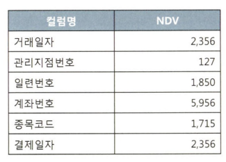
  - 현재 인덱스 구조:

    - PK: 거래일자 + 관리지점번호 + 일련번호
    - N1: 계좌번호 + 거래일자
    - N2: 결제일자 + 관리지점번호
    - N3: 거래일자 + 종목코드
    - N4: 거래일자 + 계좌번호

  - 거래일자, 결제일자는 항상 BETWEEN 또는 부등호 조건으로 조회

  - 거래일자가 항상 BETWEEN 또는 부등호 조건이라면 N3와 N4 인덱스는 둘 다 거래일자가 액세스 조건
  - N4를 제거하고 N3 뒤쪽에 계좌번호를 추가

- 개선된 구조:

  - PK: 거래일자 + 관리지점번호 + 일련번호
  - N1: 계좌번호 + 거래일자
  - N2: 결제일자 + 관리지점번호
  - N3: 거래일자 + 종목코드 + 계좌번호

  - 만약 거래일자가 BETWEEN이고 관리지점번호가 = 조건이면 비효율이 발생
    - 다음과 같이 PK 순서를 변경
      - PK: 관리지점번호 + 거래일자 + 일련번호

- **중복제거 실습 2**

  - 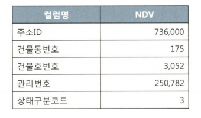
  - 현재 구조:

    - PK: 주소ID + 건물동번호 + 건물호번호 + 관리번호
    - N1: 상태구분코드 + 관리번호
    - N2: 관리번호
    - N3: 주소ID + 관리번호

    - 상태구분코드는 NDV가 3이므로 선택도가 매우 높음
    - 상태구분코드로만 조회할 때는 N1 인덱스가 효율적이지 않음
    - N1 인덱스가 의미가 있으려면 상태구분코드와 관리번호를 항상 같이 조회해야함

- 개선된 구조:

  - PK: 주소ID + 건물동번호 + 건물호번호 + 관리번호
  - N1: 관리번호 + 상태구분코드
  - N3: 주소ID + 관리번호

### 3.4.8 인덱스 설계도 작성

- 인덱스 설계 시 시스템 전체 효율 고려
