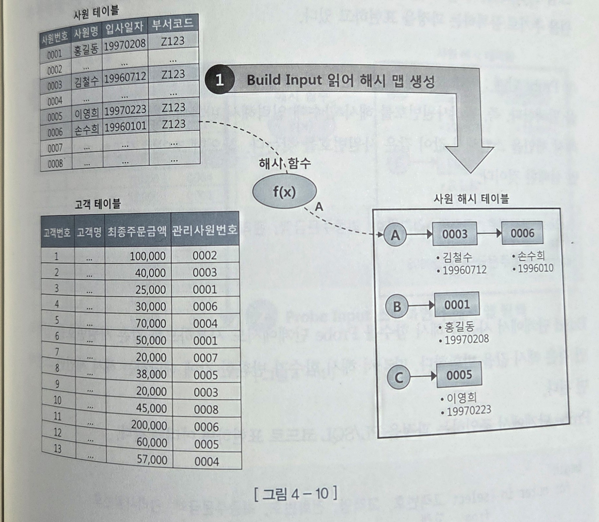
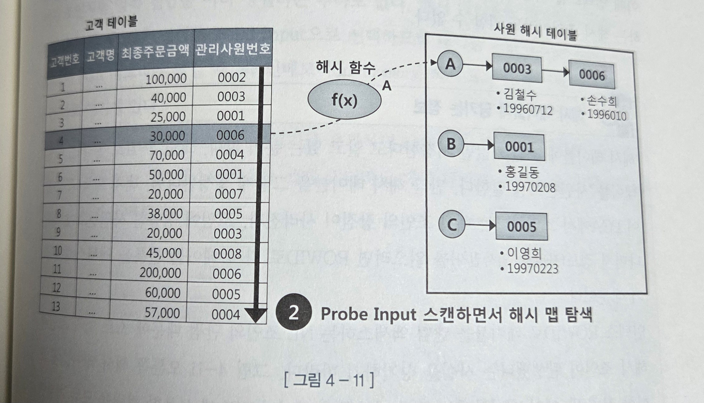
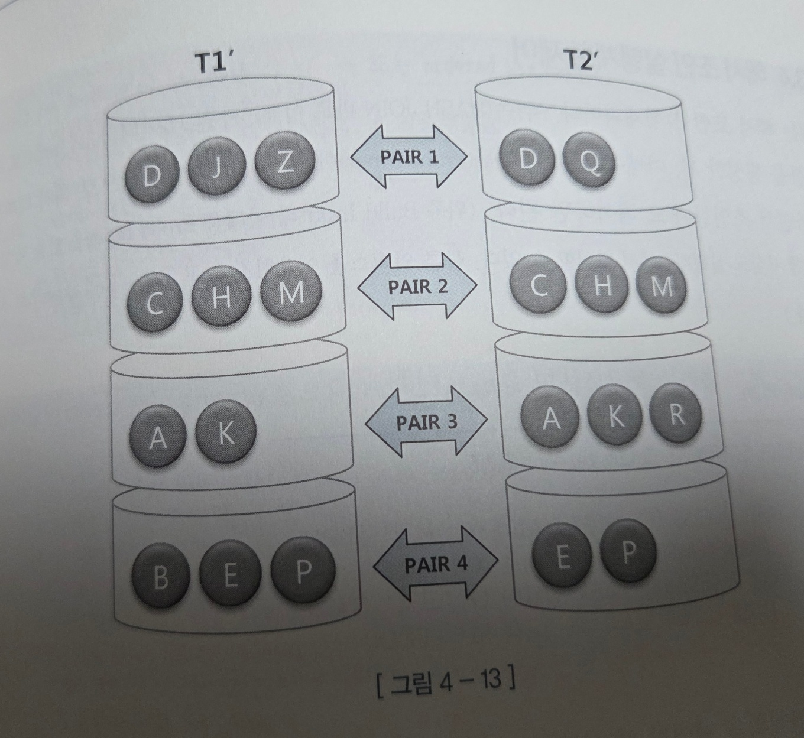
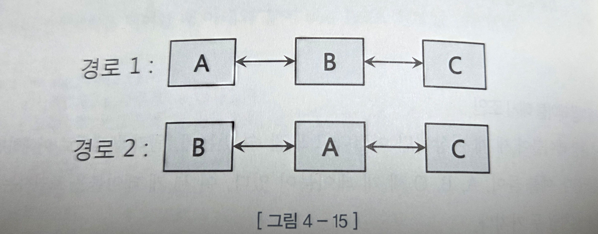
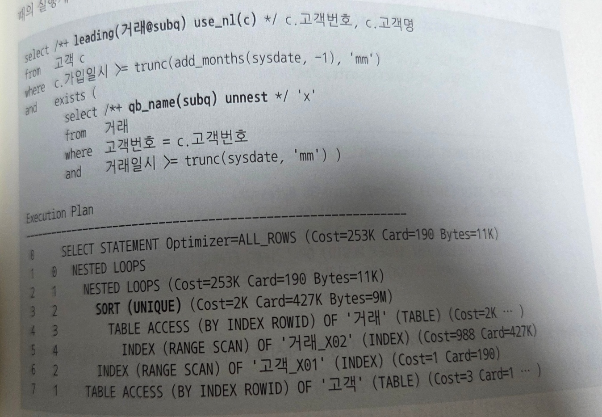
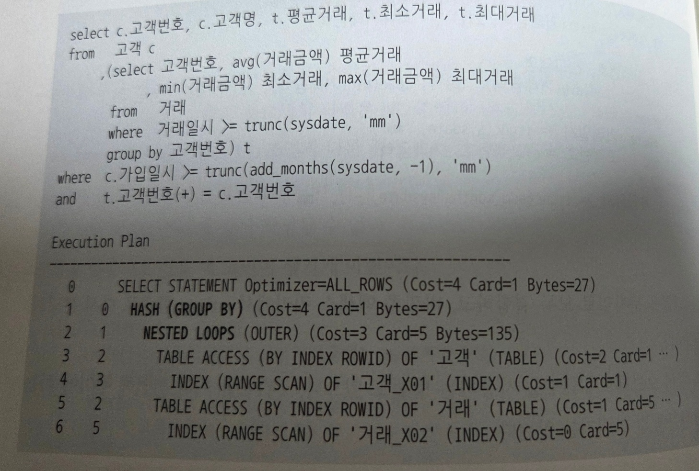
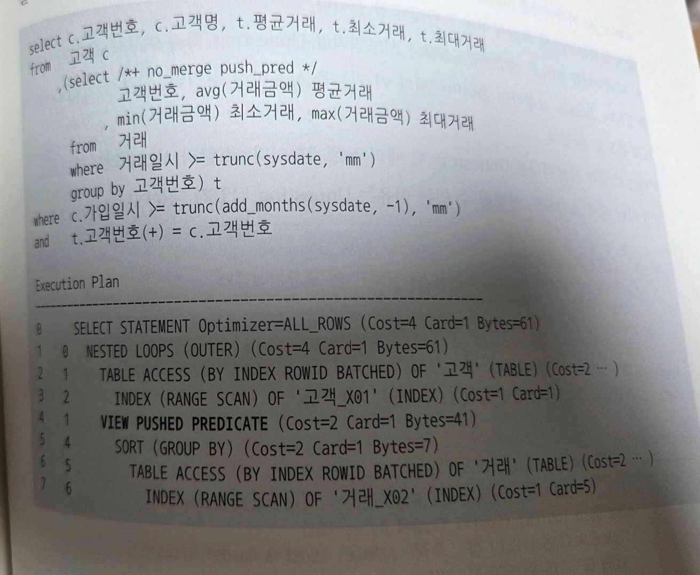

### 해시조인


| 조인 방식   | 인덱스 사용 | 대량 데이터 성능      | 성능 안정성 | 주요 부담                |
|------------|-------------|-----------------------|-------------|--------------------------|
| **NL 조인** | O           | 낮음 (랜덤 I/O)        | 불안정      | 인덱스 + 버퍼 히트율 의존 |
| **소트 머지** | X           | 높음                  | 안정        | 양쪽 정렬                |
| **해시 조인** | X           | 가장 높음             | 안정        | 한쪽 해시 테이블 생성


#### 기본 메커니즘

1. Build 단계 : 작은 쪽 테이블(Build Input)을 읽어 해시 테이블을 생성한다.
2. Probe 단계 : 큰 쪽 테이블(Probe Input)을 읽어 해시 테이블을 탐색하면서 조인한다.

```

-- use_hash : 해시 조인을 사용
-- ordered를 명시하였으므로 사원 테이블을 기준으로 해시 맵을 생성

SELECT /* ordered use_hash(c) */
   e.사원번호,e.사원명,e.입사일자
   ,c.고객번호,c.고객명,c.전화번호,c.최종주문금액
FROM 사원 e, 고객 c
WHERE c.관리자사원번호 = e.사원번호
AND e.입사일자 >= '19960101'
AND e.부서코드 = 'Z123'
AND c.최종주문금액 >= 20000


```
1) Build 단계
   * 조건에 해당하는 테이블을 읽어 해시 테이블을 생성한다.
   * 조인 키뿐만 아니라 SQL에서 사용하는 모든 컬럼을 함께 저장한다.
   * 조인 컬럼을 해시 함수의 키값으로 사용한다.
   * 해시 테이블은 PGA 영역에 할당된 Hash Area에 저장되며, 크기가 클 경우 Temp 테이블스페이스를 사용한다.
   


```
-- 사원 테이블을 읽어 해시 맵을 생성
-- 조인 컬럼인 사원번호를 해시 맵의 키 값으로 사용
>  사원 번호를 해시함수 키값으로 해시 체인을 찾고, 그 해시 체인에 데이터를 연결

SELECT 사원번호, 이름,입사일자
FROM 사원
WHERE 입사일자 >= '19960101'
AND 부서코드 = 'Z123'

```

2) Probe 단계
   * 조건에 해당하는 고객 데이터를 하나씩 읽어 앞서 생성한 해시 테이블을 탐색한다.
   * 매칭되면 조인 성공, 없으면 실패로 처리한다.
   * Build 단계에서 사용한 해시 함수를 Probe 단계에서도 동일하게 사용하므로, 같은 사원번호는 같은 해시 체인을 반환한다.
   * 따라서 해시 함수가 반환한 값에 해당하는 해시 체인만 스캔하면 된다.
     

```
SELECT
   ...
FROM 고객
WHERE 최종주문금액 >= 20000

```
##### 해시조인이 빠른 이유

1. PGA 메모리에서 작업: 래치 경합이 발생하지 않는다.
2. 정렬 작업 불필요: 소트 머지 조인과 달리 정렬 과정이 없다.

##### 소트 머지 조인 vs 해시 조인


| 항목          | 소트 머지 조인                       | 해시 조인                                 |
|---------------|--------------------------------------|-------------------------------------------|
| **사전작업**  | 양쪽 집합을 모두 정렬해서 PGA에 담기  | 작은 쪽 집합으로 해시맵 생성하여 PGA에 담기 |
| **정렬 필요?** | 양쪽 다 정렬 필수                    | 정렬  없음                            |
| **PGA 사용** | O     | O        |
| **Temp 테이블스페이스** | 대량 데이터 시 거의 필수           | 작은 쪽이 메모리에 들어가면 불필요        |
|       | 양쪽 정렬 + 디스크 I/O         | 정렬 없음 + 디스크 I/O 최소     |


소트 머지 조인도 PGA 메모리 영역을 사용하지만 해시 조인이 더 빠르다. 그 이유는 다음과 같다.
* 소트 머지 조인은 양쪽 집합을 모두 정렬해서 PGA에 담는데, 크기가 크면 디스크에 쓰는 작업인 Temp 테이블스페이스 사용이 거의 필수다.
* 해시 조인은 양쪽 집합 중 작은 쪽을 선택해 해시맵을 만들기 때문에, 두 집합 모두 Hash Area에 담을 수 없을 정도로 큰 경우가 아니라면 디스크에 쓰는 작업이 전혀 발생하지 않는다.


#### 대용량 Build Input 처리

두 테이블 모두 대용량으로 인메모리 해시 조인이 불가능한 경우, 분할 정복(Divide & Conquer) 방식으로 나누어 처리한다.

1) 파티션 단계
   독립적으로 처리할 수 있는 여러 개의 작은 서브 집합으로 분할하여 파티션 짝(Pair)을 생성하는 단계다.
   * 조인하는 양쪽 집합의 조인 컬럼에 해시 함수를 적용하고, 반환된 해시 값에 따라 동적으로 파티셔닝한다.
   * 파티셔닝된 양쪽 집합을 디스크 Temp 공간에 저장하므로, 인메모리 해시 조인보다 성능이 떨어진다.
   
2) 조인 단계

   각 파티션 짝(Pair)에 대해 하나씩 조인을 수행한다.
   * 각 파티션 짝의 Build Input과 Probe Input은 독립적으로 결정된다.
   * 파티션 하기 전 어느 쪽이 작은 테이블이었는지와 관계없이, 각 파티션 짝별로 작은 쪽을 Build Input으로 선택하여 해시 테이블을 생성한다.

   

##### 해시 조인 실행계획 제어

**실행계획**
```
** 해석: 사원 데이터를 사원 데이터(Build Input) 로 해시 테이블을 생성한 후,
 고객 테이블(Probe Input)에서 읽은 조인 키값으로 해시 테이블을 탐색하면서 조인한다.
 
-- 위쪽 테이블 기준으로 해시 맵을 생성한 후, 아래쪽 테이블에서 읽은 조인 키값으로 해시 맵 탐색
-- 소트할 때 인덱스를 사용해서 인덱스로 표현된 것 뿐이지, 인덱스 없이 스캔했다면 TABLE FULL SCAN으로 나올 수 도 있다.
HASH JOIN
     TABLE ACCESS (BY INDEX ROWID) OF '사원' TABLE > [Build Input]
        INDEX (RAGNE SCAN) OF '사원_X1' (INDEX)
     TABLE ACCESS (BY INDEX ROWID) OF '고객' TABLE > [Probe Input]
        INDEX (RAGNE SCAN) OF '고객_X1' (INDEX)

```


| 구분                              | 역할 / 특징                 | Build Input(해시 생성 대상) 결정 방식                          | 조인 순서 제어        |
| ------------------------------- | ----------------------- |------------------------------------------------------| --------------- |
| **기본 해시 조인 (자동)**               | 옵티마이저가 자체 판단으로 해시 조인 수행 | 옵티마이저가 각 테이블의 조건절에 대한 **카디널리티(행 수)** 가 **작은 테이블** 선택 | 자동 결정           |
| **USE_HASH(테이블명)**              | 지정 테이블 간 해시 조인을 유도      | 옵티마이저가 **자동으로 작은 테이블** 선택                            | 자동 결정           |
| **USE_HASH + LEADING(테이블명1 …)** | 해시 조인 + 명시적 조인 순서 제어    | `LEADING`의 **첫 번째 테이블**이 Build Input                 | 명시적 순서          |
| **USE_HASH + ORDERED**          | FROM절 순서 그대로 조인         | **FROM절 첫 번째 테이블**이 Build Input                      | FROM절 순서 고정     |
| **FULL SCAN / INDEX SCAN 여부**   | 실행계획상 접근 방법             | 인덱스가 있으면 RANGE SCAN, 없으면 TABLE FULL SCAN             | 접근 방식은 옵티마이저 판단 |


#### 세 개 이상 테이블 해시 조인


세 테이블을 조인하는 방식은 A,B,C 조인시 A<->B<->C 방식이다.

```
select*
from A,B,C
where A.key = B.key
and B.key = C.key

select*
from A,B,C
where A.key = B.key
and A.key = C.key

```



##### 세 테이블 조인 시 힌트 사용

1. leading 힌트로 지정한다. : 첫번째 파라미터로 지정한 테이블은 무조건 Build Input 으로 선택된다.

```
SELECT /*+ leading(T1 T2 T3) USE_HASH(T2) USE_HASH(T3) */ *
FROM T1, T2, T3
WHERE T1.key = T2.key
AND T2.key = T3.key
```


2. T2를 Build Input으로 선택하는 방식
```
 SELECT /*+ leading(T1 T2 T3) swap_join_inputs(T2) */ *
```
3. T1과 T2 조인한 결과 집합을 Build Input으로 선택하는 것이 아닌 T3를 Probe Input으로 선택하는 방식
```
 SELECT /*+ leading(T1 T2 T3) no_swap_join_inputs(T3) */ *
```

* Build Input을 변경하고 싶은 경우: swap_join_inputs
* 조인한 결과 집합을 Build Input으로 사용하고 싶은 경우: no_swap_join_inputs


#### 조인 메소드 선택 기준 

조인 방식 선택에는 반드시 근거가 있어야 한다.

**소량 데이터와 대량 데이터의 기준**

데이터의 많고 적음이 아니라, 
NL 조인 기준으로 최적화했는데도 랜덤 액세스가 많아 만족할 만한 성능이 나오지 않으면 대량 데이터로 간주한다.


| 상황                                                             | 권장 조인 방식                    | 선택 이유 / 특징                                            |
| -------------------------------------------------------------- | --------------------------- | ----------------------------------------------------- |
| **소량 데이터 조인**                                                  | **NL 조인**   | 인덱스 기반 랜덤 액세스에 유리함. 소량 데이터일수록 효율적.                    |
| **대량 데이터 조인**                                                  | **해시 조인**        | 인덱스 접근보다 메모리 기반 해시 탐색이 유리.                            |
| **대량 데이터 조인인데 해시 조인 불가** <br> (등치 조건이 아님 / 조인 조건 없음, 즉 카테시안 곱) | **소트 머지 조인** | 해시 조인은 등치(=) 조인만 가능하므로, 비등치(<, >, BETWEEN 등) 조인 시 사용. |
| **수행 빈도가 높고, NL 조인과 해시 조인의 성능이 비슷한 경우**                        | **NL 조인**                   | 인덱스를 재사용 가능하며, CPU·메모리 부담이 적음.                        |
| **해시 조인이 약간 더 빠른 경우**                                          | **NL 조인**                   | 잦은 해시 테이블 생성은 오히려 전체 시스템 부하 유발.                       |
| **해시 조인이 압도적으로 빠른 경우**                                         | **해시 조인**                   | 대량 데이터 처리에서는 해시 조인의 효율이 극대화됨.                         |

#### NL 조인을 먼저 고려해야하는 이유?

>NL 조인에 사용하는 인덱스는 영구적으로 유지하면서 다양한 쿼리를 위해 공유 및 재사용하는 자료구조다. 반면, 해시 테이블은 단 하나의 쿼리를 위해 생성하고 조인이 끝나면 곧바로 소멸하는 자료구조다.


🔹 해시 조인 사용이 적합한 조건 

✅ 수행 빈도가 낮고
✅ 쿼리 수행 시간이 길며
✅ 대량 데이터를 조인할 때

==> 배치 프로그램 / DW / OLAP 성 쿼리 환경에 최적화됨


---


### 서브쿼리 조인


#### 서브쿼리 변환이 필요한 이유
옵티마이저는 비용(Cost)를 평가하고 실행계획을 생성하기에 앞서 사용자로 부터 전달 받은 SQL을
최적화에 유리한 형태로 변환시키는 작업,쿼리 변환부터 진행한다.

쿼리변환 : 옵티마이저가 SQL을 분석해 의미적으로 동일하면서도 더 나은 성능이 기대되는 형태로 재작성하는 것


```
SELECT c.고객번호, c.고객명, t.평균거래, t.최소거래, t.최대거래
     , (SELECT 고객분류명 FROM 고객분류 WHERE 고객분류코드 = c.고객분류코드) -> 스칼라서브쿼리
  FROM 고객 c
     , (SELECT 고객번호, AVG(거래금액) 평균거래
             , MIN(거래금액) 최소금액, MAX(거래금액) 최대거래
          FROM 거래
         WHERE 거래일시 >= TRUNC(SYSDATE, ‘MM’)
         GROUP BY 고객번호) t -> 인라인 뷰
 WHERE c.가입일시 >= TRUNC(ADD_MONTHS(SYSDATE, -1), ‘mm’)
   AND t.고객번호 = c.고객번호
   AND exists (SELECT ‘X’
                 FROM 고객변경이력 h
                WHERE h.고객번호 = c.고객번호
                  AND h.변경사유코드 = ‘ZCH’
                  AND c.최종변경일시 BETWEEN h.시작일시 AND h.종료일시) -> 중첩된 서브쿼리
```


| 구분           | 설명                                                                            |
| ------------ |-------------------------------------------------------------------------------|
| **인라인 뷰**    | `FROM` 절에서 사용하는 서브쿼리                                                          |
| **중첩 서브쿼리**  | 결과집합을 한정하기 위해  `WHERE` 절에서 사용하는 서브쿼리                                          |
| **스칼라 서브쿼리** | 한 레코드당 정확히 하나의 값을 반환하는 서브쿼리 |


> 옵티마이저는 “쿼리 블록” 단위로 최적화한다. 메인 쿼리와 서브 쿼리를 각각 따로 최적화한다. -> 서브쿼리별로 최적화한 쿼리는 전체적으로 최적화됐다고 말할수 없다.


#### 서브쿼리와 조인

서브쿼리는 메인쿼리에 종속되므로 단독으로 수행불가하다. 메인쿼리 건 수 만큼 값을 받아 반복적으로 필터링 하는 방식으로 진행해야한다.

##### 필터 오퍼레이션
```

no_unnest : 서브쿼리를 풀어내지말고 그대로 수행


SELECT c.고객번호, c.고객명
  FROM 고객 c
 WHERE c.가입일시 >= TRUNC(add_months(sysdate, -1), ‘mm’)
   AND EXISTS (SELECT /*+ no_unnest */
                 FROM 거래
                WHERE 고객번호 = c.고객번호
                  AND 거래일시 >= TRUNC(SYSDATE, ‘mm’))
Excution    Plan
0    SELECT STATMENT Optimizer=ALL_ROWS (Cost=289 Card=1 Bytes=39)
1    0    FILTER
2    1    TABLE ACCESS (BY INDEX ROWID) OF ‘고객’ (TABLE) (Cost=4 Card=190 ...)
3    2        INDEX (RANGE SCAN) OF ‘고객_X01’ (INDEX) (Cost=2 Card=190.)
4    1    INDEX (RANGE SCAN) OF ‘고객_X01’ (INDEX) (INDEX) (Cost=3 Card=4K Bytes=92k)


```

1. **NL 조인(Nested Loop Join)**과 처리 루틴이 거의 동일하다.
2. 실행계획에서 FILTER를 NESTED LOOPS로 치환해도 해석이 가능하다.
3. **부분 범위 처리(Partial Fetch)**도 가능하다


|         | 설명                                                           |
| --------- |--------------------------------------------------------------|
| **조인 방식** | 메인쿼리(고객)의 한 로우가 서브쿼리(거래)와 조인에 성공하면 진행을 멈추고, 메인 쿼리의 다음 로우로 진행 |
| **효과**    | 메인쿼리의 결과집합이 M쪽(서브쿼리) 크기로 확장되는 것을 방지                          |
| **캐싱 기능** | 서브쿼리 입력값에 따른 결과(true/false)를 PGA 메모리에 캐싱                     |
| **캐싱 이점** | 동일 입력값 재사용 시 서브쿼리 재실행 생략 → 성능 향상                             |
| **캐싱 단위** | 쿼리 단위로 PGA 메모리에 캐시를 생성/반환한다.                       |
| **조인 순서** | 메인 쿼리가 항상 드라이빙 집합으로 고정된다.                            |


#### 서브쿼리 Unnesting

> 서브쿼리를 “풀어서(Flattening)” 메인쿼리와 같은 레벨로 만드는 최적화.
>
옵디마이저가 대개 Unnesting을 선택한다.
서브쿼리의 계층 구조를 해제해 일반 조인처럼 다양한 최적화 기법을 적용할 수 있게 한다.

> /*+ unnest nl_sj */

NL_SJ은 NL 세미조인 방식이다.
NL 조인과 프로세스는 같지만 메인쿼리와 서브쿼리의 조인 컬럼이 조인에 성공하는 순간 멈추고 메인 쿼리의 다음 로우를 계속 처리한다.
NL 세미조인은 캐싱 기능도 있다.

Unnesting된 서브쿼리는 메인 쿼리 집합보다 먼저 처리할 수 있다. 

* Unnesting된 서브쿼리가 먼저 드라이빙되도록 leading 힌트를 사용했을 때 실행계획

서브쿼리 집합에대한 Sort Unique 오퍼레이션 부터 수행 했음을 확인 가능



-> 이와 같이 Unnesting을 사용해서 서브쿼리와 메인쿼리를 같은 레벨로 만들면,
다양한 조인 메서드를 선택할 수 있고, 순서도 정할 수 있다.

옵티마이저는 많은 조인 테크닉을 가지기 때문에 조인 형태로 변환 했을 때 필터 오퍼레이션보다 더 좋은 실행경로를 찾을 가능성이 높아진다.


**⚠️ ROWNUM 주의사항**

```

rownum은 옵티마이징 기능을 사용하지못하게 막는 효과가 있다.
중복으로 쓰게 되면 Unnesting이 동작하지 않기에 중요 옵티마이징 기능을 사용하지 못한다.

EXISTS ( 
SELECT /*+ UNNEST NL_SJ */ 'X'   > 힌트를 사용해도 안됨
FROM 수신대상자
WHERE 글번호 = b.글번호
AND 수신자 = :meb_no
AND ROWNUM <= 1
)

```


##### 서브쿼리 Pushing


- Unnesting 되지 않는 서브쿼리는 기본적으로 필터 방식으로 처리되며, 실행계획의 마지막 단계에서 실행된다.
- 서브쿼리 푸싱(push_subq)은 이러한 서브쿼리를 초기 단계에서 실행하도록 강제하여, 조인 등 후속 단계로 넘어가는 로우 수를 줄이고 쿼리 성능을 향상시킨다.

  
```declarative
EXISTS (
SELECT /*+ no_unnest push_subq */ 'X'
FROM 상품분류
WHERE 상품분류코드 = p.상품분류코드
AND 상위분류코드 = 'AK'
)

```

|         | 설명                                                     |
| --------- |--------------------------------------------------------|
| **기본 동작** | 서브쿼리 필터링을 가능한 한 앞 단계에서 처리하도록 강제                        |
| **효과**    | 서브쿼리 결과를 미리 필터링해, 이후 단계의 로우 수 감소 → 성능 향상               |
| **힌트**    | `push_subq` (활성화) / `no_push_subq`  (비활성화)             |
| **주의**    | `no_nunest` 힌트와 함께 사용해야 적용 가능 (Unnesting된 서브쿼리엔 적용 안 됨) |


#### 뷰와 조인

➡️ 문제점

최적화 단위가 쿼리 블록이므로 옵티마이저가 뷰쿼리 변환하지 않으면, 뷰 쿼리 블록을 독립적으로 최적화한다.
뷰를 독립적으로 최적화하니, 테이블과 조인은 다음에 처리한다.

➡️ 뷰 안에서 조인에 필요하지 않은 모든 데이터를 불러올 수 도 있다

💡 이때 머징을 사용하면, 인라인뷰 밖에 있는 조건을 인라인뷰 안에서 작동하도록 강제할 수 있다.

> 힌트 : merge , no_merge

```
select c.고객번호 --이하 생략
from 고객 c
, (select 고객번호, avg(거래금액) 평균거래, min(거래금액) 최소거래, max(거래금액) 최대거래
from 거래
where 거래일시 >= trunc(sysdate,'mm') -- 당월 발생한 거래
group by 고객번호) t
where c.가입일시 >= trunc(add_months(sysdate, -1), 'mm') --전월 이후 가입 고객
and t.고객번호 = c. 고객번호
```

 인라인 뷰 바깥에 “전월 이후 가입 고객” 조건이 뷰 내부에 반영되지 않아 불필요한 데이터를 읽어야한다.


💡 merge를 사용하면 쿼리가 다음과 같이 변환된다.

```
SELECT c.고객번호, c.고객명
FROM 고객 c
    ,(select /*+ merge*/ 고객번호, avg(거래금액)
      FROM 거래
      WHERE 거래일시 >= trunc(sysdate, 'mm')
      GROUP BY 고객번호) t
WHERE c.가입일시 >= trunc(add_months(sysdate, -1), 'mm')
AND t.고객번호 = c.고객번호


SELECT c.고객번호, c.고객명, avg(거래금액)
FROM 고객 c, 거래 t
WHERE c.가입일시 >= trunc(add_months(sysdate, -1), 'mm')
AND t.고객번호 = c.고객번호
AND t.거래일시 >= trunc(sysdate, 'mm')
GROUP BY c.고객번호, c.고객명

merge 쓰면 위와 같이 쿼리가 변환된다.
```

* 단점은 조인에 성공한 전체 집합을 Group By 하고서야 데이터를 출력 할 수 있어서 부분 처리가 불가능하다.

* 부분범위 처리가 불가능한 상황에서 NL조인은 좋은 선택이 아니어서 
따라서, 뷰를 머징하고, 조인은 해쉬로 푸는 방법이 제일 좋다.

  

#### Pushdown

* 11g 이후 조인 조건 Pushdown 쿼리 변환 기능이 작동한다.

* 메인 쿼리를 실행하면서 조인 조건절 값을 건건이 뷰 안으로 밀어 넣는 기능이다.

* 옵티마이저가 뷰를 머징하면 힌트가 작동하지않음, no_merge 힌트와 같이 사용

> /*+ no_merge push_pred */

```
SELECT c.고객번호
FROM 고객 c,
     (SELECT /*+ no_merge push_pred */ 고객번호,
             AVG(거래금액) 평균거래,
             MIN(거래금액) 최소거래,
             MAX(거래금액) 최대거래
      FROM 거래
      WHERE 거래일시 >= TRUNC(SYSDATE, 'mm')
      GROUP BY 고객번호) t
WHERE c.가입일시 >= TRUNC(ADD_MONTHS(SYSDATE, -1), 'mm')
  AND t.고객번호 = c.고객번호;


SELECT c.고객번호
FROM 고객 c,
     (SELECT 고객번호,
             AVG(거래금액) 평균거래,
             MIN(거래금액) 최소거래,
             MAX(거래금액) 최대거래
      FROM 거래
      WHERE 거래일시 >= TRUNC(SYSDATE, 'mm')
        AND 고객번호 = c.고객번호 -- ✅ 조인 조건이 뷰 안으로 전달됨
      GROUP BY 고객번호) t
WHERE c.가입일시 >= TRUNC(ADD_MONTHS(SYSDATE, -1), 'mm')
  AND t.고객번호 = c.고객번호;


이와 같은 형태로 변환해준다.

```

|             | 설명                                  |
| ------------- | ----------------------------------- |
| 불필요한 I/O 감소   | 거래 전체를 읽지 않고, **조인 대상 고객만 조회**      |
| 부분범위 처리 가능    | 고객별로 조인·집계가 진행되므로, **중간에 멈출 수 있음**  |
| 머징 대비 장점      | 전체 조인 결과를 모두 모아서 `GROUP BY`하지 않아도 됨 |
| 뷰 독립 실행 대비 장점 | 뷰를 전부 읽지 않고, **건건이 조인**하면서 집계 수행    |


***  Lateral 인라인 뷰, Cross/Outer Apply 조인

: Lateral로 선언하면,인라인 뷰에서 메인쿼리 테이블의 컬럼을 참조 가능
   세가지 기존의 구문으로 원하는 실행계획을 사용할 수 있기 때문에 PushDown 기능이 잘 작동하지 않을떄만 사용하는 것을 추천 
   -> Lateral 인라인 뷰


#### 스칼라 서브쿼리와 조인

##### 스칼라 서브쿼리의 특징

* 스칼라 서브쿼리는 메인쿼리 레코드마다 정확하게 하나의 값만 반환한다.
* 메인 쿼리와 서브쿼리가 한 몸처럼 실행됨 → 컨텍스트 스위칭(별도의 쿼리 호출) 없이 효율적으로 처리.


```declarative

SELECT EMPNO, ENAME, SAL, HIREDATE
, (SELECT D.DNAME, FROM DEPT D WHERE D.DEPTNO = E.DEPTNO) AS DNAME
FROM EMP E
WHERE SAL >= 2000

SELECT /*+ ORDERED USE_NL(D) */ E.EMPNO, E.ENAME, SAL, E.HIREDATE, E.DATE, D.NAME
FROM EMP E, DEPT D
WHERE D.DEPTNO(+) = E.DEPTNO
WHERE E.SAL >= 2000
```
* 즉 위와 같이 Outer Join 문처럼 생각하면 된다.
  - DEPTNO가 일치하지 않으면 DNAME은 NULL로 출력한다는 점도 같다.
  - 차이점은 처리과정에서 캐싱작용이 일어남 

#### 스칼라 서브쿼리 캐싱 효과


오라클은 스칼라 서브쿼리를 조인처럼 반복 수행하지 않기 위해, 내부적으로 입력 값과 출력 값을 캐시에 저장한다.

실행 과정:

1. 조인 시, 메인쿼리 컬럼(E.DEPTNO 등)을 입력 값으로 사용

2. 캐시에서 해당 입력 값이 이미 존재하면, 저장된 출력 값을 바로 반환

3. 없을 경우 실제 조인 수행 후, 결과를 캐시에 저장

따라서 중복된 입력 값에 대해 조인을 반복하지 않음 → 조인 횟수 최소화 


```declarative
SELECT EMPNO, ENAME, SAL, HIREDATE
, (SELECT D.DNAME -> 출력 값 : D.DNAME
FROM DEPT D
WHERE D.DEPTNO = E.EMPNO -> 입력 값 : E.EMPNO) 
FROM EMP E
WHERE SAL >= 2000

입력 값 : 스칼라 서브쿼리에서 참조하는 메인쿼리의 컬럼 값
```

사용자 함수 호출 할 때도 스칼라 서브쿼리 형태로 작성하면 캐싱 효과 적용 가능하다.

>SELECT (SELECT GET_DNAME(E.DEPTNO) FROM DUAL)  FROM EMP E

→  GET_DNAME 함수의 결과가 캐시되어 반복 호출 비용 감소.


##### 스칼라 서브쿼리 캐싱 부작용

* 스칼라 서브쿼리 캐싱 효과는 입력 값의 종류가 소수여서 해시 충돌 가능성이 작을 때 효과가 있다.
* 반대의 경우라면 캐시를 매번 확인하는 비용 때문에 오히려 성능이 나빠지고 CPU 사용률만 높게 만든다. 메모리도 더 사용한다.
* 스칼라 서브쿼리는 쿼리 단위로 쓰고 버리기 때문에 메인쿼리 집합이 클수록 재사용성이 높아 효과가좋다.
* 반대로 집합이 작으면캐시 재사용성이 낮다.
```
select 거래번호, 고객번호,영업조직ID,거래구분코드
    ,(select 고객명 from 고객 where 고객번호 =t.고객번호) 고객명
    from 거래 t
   where 거래일자 >=to_char(add_months(sysdate , -3),'yyyymmdd') -- 50,000건
```
거래구분코드 종류: 20개

거래 건수: 50,000건

👉 거래구분코드 종류가 20개면 캐시에 모두 저장하고도 남음


```declarative
SELECT 거래번호, 고객번호, 영업조직ID, 거래구분코드,
       (SELECT 고객명 FROM 고객 WHERE 고객번호 = t.고객번호)
FROM 거래 t
WHERE 거래일자 >= TO_CHAR(ADD_MONTHS(SYSDATE, -3), 'YYYYMMDD') -- 50,000건
```
고객 수: 100만 명

거래 건수: 50,000건

👉 메인 쿼리의 각 행마다 “고객번호”가 다 달라서 캐시에 다 담을 수 없음.

👉 최근 3개월간 수백명이내 일부 고객만 거래를 발생시켰어야 도움이 된다. 


```declarative

select 계좌번호, .......
(select brnch_nm(관리지점코드) from dual) 관리지점명,
(select brnch_nm(개설지점코드) from dual) 개설지점명
from 계좌
where 고객번호 = :고객번호

```
👉 보통 고객당 계좌수는 많지않기 때문에 쓰지도 않을 캐시를할당해서값을 채웠다가버리는 결과를 낳는다.


##### 두 개 이상의 값 반환

두 개 이상의 값을 반환할 수 없다는 제약이 있다. 

쿼리를 아래와 같이 작성할 수 없다.

```declarative

SELECT c.고객번호, c.고객명
, (SELECT AVG(거래금액) , MAX(거래금액) ,MIN(거래금액)
FROM 거래
WHERE 거래일시 >= TRUNC(SYSDATE, ‘mm’
AND 고객번호 = c.고객번호))
FROM 고객 c
WHERE c.가입일시 >= TRUNC(add_months(sysdate, -1), ‘mm’)

```

이렇게 작성을 하면 같은 데이터를 반복해서 읽는 비효율이 있다.
```
SELECT c.고객번호, c.고객명
, (SELECT MIN(거래금액)
FROM 거래
WHERE 거래일시 >= TRUNC(SYSDATE, ‘mm’
AND 고객번호 = c.고객번호))
, (SELECT AVG(거래금액), MIN(거래금액), MAX(거래금액)
FROM 거래
WHERE 거래일시 >= TRUNC(SYSDATE, ‘mm’
AND 고객번호 = c.고객번호))
, (SELECT MAX(거래금액)
FROM 거래
WHERE 거래일시 >= TRUNC(SYSDATE, ‘mm’
AND 고객번호 = c.고객번호))
FROM 고객 c
WHERE c.가입일시 >= TRUNC(add_months(sysdate, -1), ‘mm’)

```

```declarative

* 구하는 값을문자열로 모두 결합하고,바깥쪽 엑세스 쿼리에서 substr 함수로 분리하 는방식

SELECT 고객번호, 고객명
, TO_NUMBER(SUBSTR(거래금액, 1, 10)) 평균거래금액
, TO_NUMBER(SUBSTR(거래금액, 11, 10)) 최소거래금액
, TO_NUMBER(SUBSTR(거래금액, 21)) 최대거래금액
FROM (SELECT C.고객번호, C.고객명
, (SELECT LPAD(AVG(거래금액), 10 || LPAD(MIN(거래금액), 10 || LPAD(MAX(거래금액), 10
FROM 거래
WHERE 거래일시 >= TRUNC(SYSDATE, ‘mm’
AND 고객번호 = c.고객번호) 거래금액
FROM 고객 c
WHERE c.가입일시 >= TRUNC(add_months(sysdate, -1), ‘mm’)
)

```

* 인라인 뷰 
* 아래 실행계획 처럼 Group By 때문에 부분처리가 안된다는 문제가 있음
 

* Pushdown 



##### 스칼라 서브쿼리 Unnesting

✅ NL 조인 방식으로 조인되므로, 캐싱 효과가 크지 않으면 랜덤 I/O 부담이 크다.
   다른 조인방식을 선택하기 위해서 Unnesting 이 필요할때가 있다.

특히 대량의 데이터를 처리하는 병렬 쿼리는 해시 조인으로 처리해야 효과적이기 때문이다.


```declarative

**힌트로 유도 

SELECT c.고객번호, c.고객명,
(SELECT /*+ no_unnest */ ROUND(AVG(거래금액), 2) 평균거래금액
FROM 거래
WHERE 거래일시 >= TRUNC(SYSDATE, 'mm')
AND 고객번호 = c.고객번호)
FROM 고객 c
WHERE c.가입일시 >= TRUNC(ADD_MONTHS(SYSDATE, -1), 'mm');

```

###### optimizer_unnest_scalar_sq 파라미터

| 설정값       | 의미                                                     |
| --------- | ------------------------------------------------------ |
| **TRUE**  | 옵티마이저가 상황에 따라 스칼라 서브쿼리를 **Unnesting할지 자동 결정**          |
| **FALSE** | 옵티마이저는 Unnesting 기능을 사용하지 않음. 단, 사용자가 **힌트로 직접 유도 가능** |


