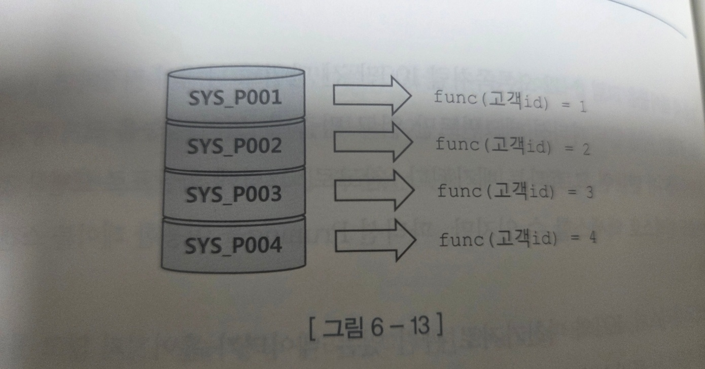
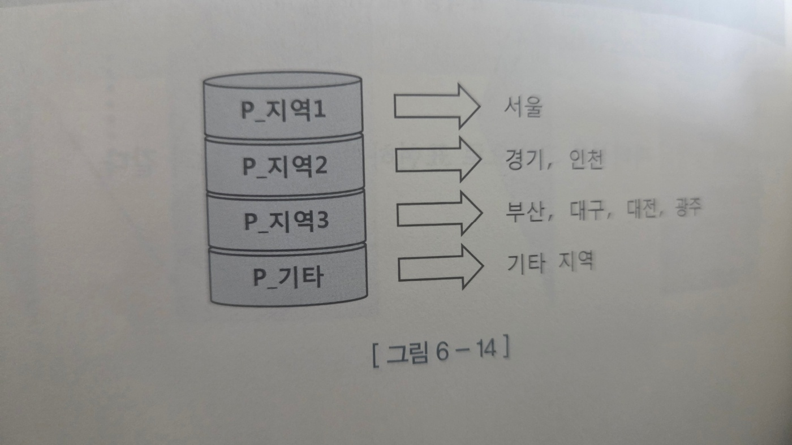
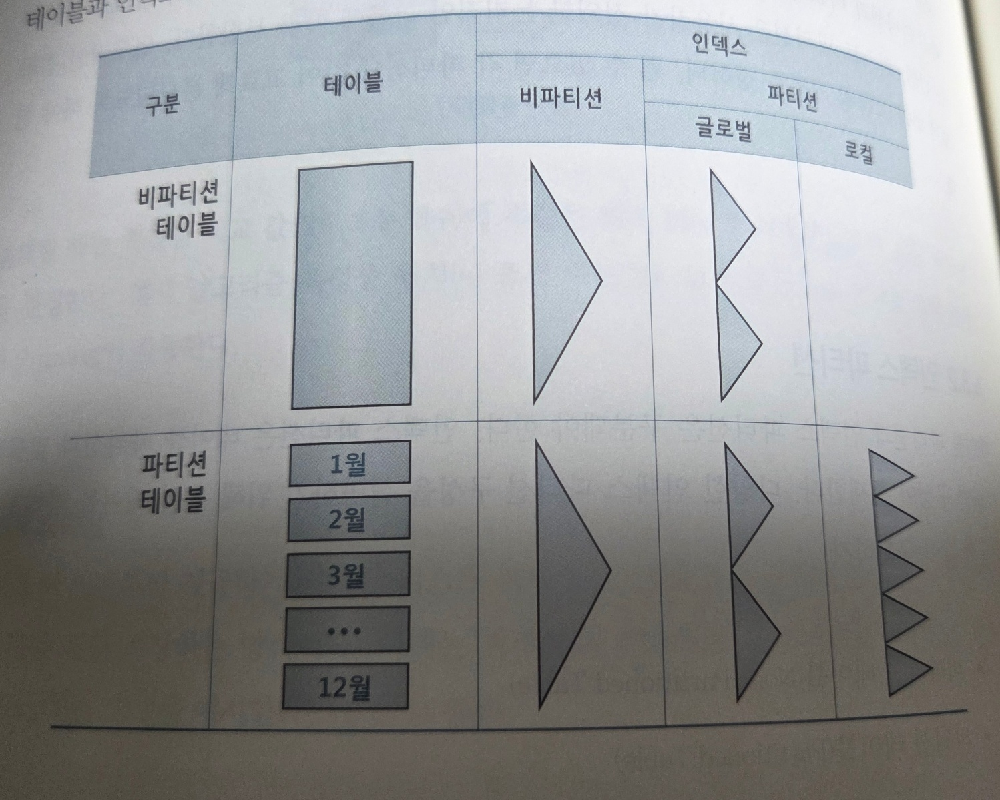
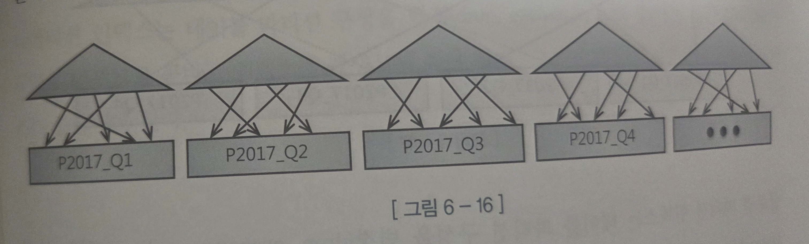
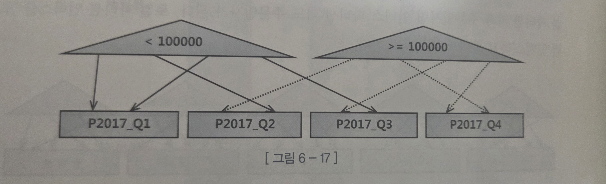
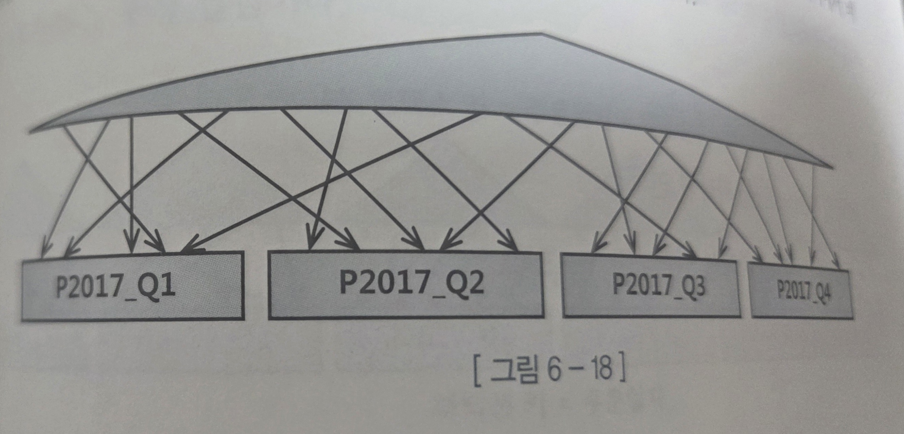
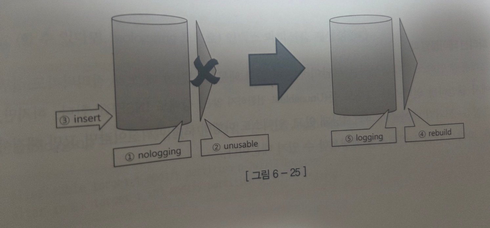
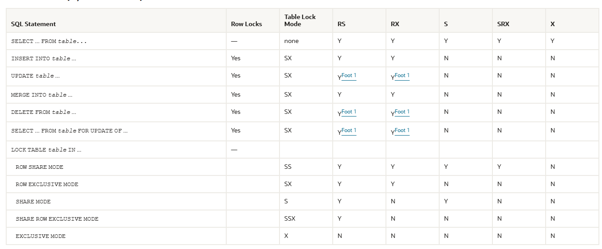
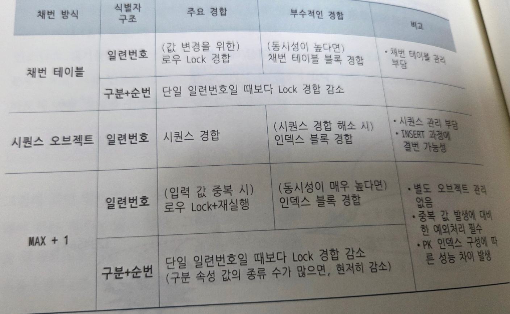
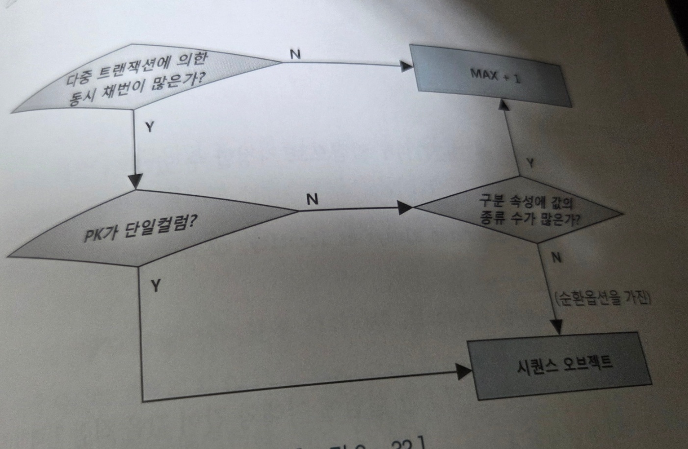

### 파티션을 활용한 DML 튜닝

#### 테이블 파티션

파티셔닝 : 테이블 또는 인덱스 데이터를 특정 컬럼(파티션 키) 값에 따라 별도 세그먼트에 나눠서 저장하는 것

파티션이 필요한 이유
* 관리적 측면 : 파티션 단위 백업, 추가, 삭제, 변경 → 가용성 향상
* 성능적 측면 : 파티션 단위 조회 및 DML, 경합 또는 부하분산

1. Range 파티션 : 값의 범위에 따라 파티셔닝

```
create table 주문 (.........)
partition by range(주문일자) (
	partition P2017_Q1 values less than ('20170401')
	, partition P2017_Q2 values less than ('20170701')
	, partition P2017_Q3 values less than ('20171001')
	, partition P2017_Q4 values less than ('20180101')
	, partition P2018_Q1 values less than ('20180401')
	, partition P9999_MX values less than (MAXVALUE)
);
```

 

```declarative
SELECT * 
FROM 주문 
WHERE 주문일자 >= '20120401' 
  AND 주문일자 <= '20120630';

성능 향상 원리) 파티션 Pruning
파티션 전체가 아닌일부 파티션 세그먼트만 읽고 멈출 수 있어서 성능 향상
```

2. 해시 파티션 : 파티션 키값을 해시 함수에 입력해서 반환받은 값이 같은 데이터를 같은 세그먼트에 저장하는 방식

* 파티션 개수만 사용자가 결정하고 데이터 분산 알고리즘은 해시 함수가 결정한다.
  
```declarative
create table 고객(
      고객id varchar2(5)
    , 고객명 varchar2(10)
    , … 
)
partition by hash(고객id) partitions 4;

검색할 때는 조건절 비교 값(상수 또는 변수)에 똑같은 해시 함수를 적용함으로써 읽을 파티션을 결정한다.
해시 알고리즘 특성상 등치(=) 조건 또는 IN-List 조건으로 검색할 때만 파티션 Prning이 작동한다.

```

| 구분                | 설명                           |
| ----------------- | ---------------------------- |
| **파티션 기준**        | 해시 함수 결과값                    |
| **분산 제어**         | 오라클 내부 해시 알고리즘이 담당           |
| **적합한 컬럼**        | 고객ID 등 **고유하고 균등 분포**를 가진 컬럼 |
| **효과적인 검색 조건**    | `=` 또는 `IN` 조건               |
| **Pruning 작동 조건** | 등치(=) 또는 IN 조건에서만 가능         |


3. 리스트 파티션 : 사용자가 직접 정의한 그룹 에 따라 데이터를 분리 저장하는 방식

```declarative
CREATE TABLE 인터넷매물 (
    물건코드   VARCHAR2(5),
    지역분류   VARCHAR2(4),
    ...
)
PARTITION BY LIST (지역분류) (
      PARTITION p_지역1 VALUES ('서울'),
      PARTITION p_지역2 VALUES ('경기', '인천'),
      PARTITION p_지역3 VALUES ('부산', '대구', '대전', '광주'),
      PARTITION p_기타  VALUES (DEFAULT)  -- 기타 지역
);

```
 

| 구분             | 설명                               |
| -------------- | -------------------------------- |
| **파티션 기준**     | 사용자가 정의한 **값의 목록(List)**         |
| **저장 방식**      | 값의 **순서와 무관**, 지정된 목록에 따라 저장     |
| **관리 용이성**     | 논리적 그룹 단위로 관리 가능 (예: 지역별, 국가별 등) |
| **Pruning 조건** | 리스트 항목에 대한 `=` 또는 `IN` 조건        |


| 구분            | 기준        | 데이터 분배 주체        | Pruning 작동 조건              | 특징             |
| ------------- | --------- | ---------------- | -------------------------- | -------------- |
| **Range 파티션** | 값의 **범위** | 사용자가 범위 지정       | 범위 조건(`BETWEEN`, `<`, `>`) | 이력/기간성 데이터에 적합 |
| **Hash 파티션**  | 해시 함수 결과값 | **오라클 내부 해시 함수** | 등치(`=`), `IN`              | 균등 분산에 유리      |
| **List 파티션**  | 값의 **목록** | 사용자가 목록 지정       | 등치(`=`), `IN`              | 논리적 그룹 관리에 적합  |


#### 인덱스 파티션

파티션 여부

- 비파티션 테이블
- 파티션 테이블

파티션이 커버하는 테이블 범위

- 로컬 파티션 인덱스
- 글로벌 파티션 인덱스
- 비파티션 인덱스 



#### 로컬 파티션 인덱스 (로컬인덱스)

```declarative
CREATE INDEX 주문_X01 ON 주문 (주문일자, 주문금액) LOCAL;
CREATE INDEX 주문_X01 ON 주문 (고객ID, 주문일자) LOCAL;

```
- 계절별로 별로의 색인을 만드는 것과 같다.
- 인덱스 파티션은 테이블 파티션 속성을 그대로 상속 받는다.
- 테이블 파티션 키가 주문일자면 인덱스 파티션 키도 주문 일자가 된다.



- 테이블과 정확히 1:1 대응 관계를 갖도록 파티션을 자동으로 관리해준다.
- 테이블 파티션 구성을 변경해도 인덱스를 재생성할 필요가 없다.
- 변경작업이 금방 끝나서 Peek 시간대만 피하면 서비스를 중단하지않고도 작업 가능하다.

#### 글로벌 파티션 인덱스

```declarative
CREATE INDEX 주문_X01 ON 주문 (주문금액,주문일자) GLOBAL;

partition by range(주문금액) (
partition P_01 values less than (10000)....

```
- 파티션을 테이블과 다르게 구성한 인덱스
* 파티션 유형, 파티션 키, 파티션 기준 값 정의..
* 
  글로벌 파티션 인덱스는 파티션 구성을 변경하는 순간 Unusable 상태로 변해서 인덱스를 재생성 해야한다.
* 즉, 서비스를 중단 해야한다.
  


#### 비파티션 인덱스 (글로벌 비파티션 인덱스)

* 파티셔닝 하지 않은 인덱스
* 파티션 구성을 변경하는 순간 Unusable 상태로 변해서 인덱스를 재생성 해야한다.> 서비스를 중단 해야한다.
```declarative
CREATE INDEX 주문_X01 ON 주문 (고객ID,배송일자);
```


#### 파티션 인덱스

#### Prefixed VS NonPrefixed

* Prefixed : 인텍스 파티션 키 컬럼이 인덱스 키 컬럼 왼쪽 선두에 위치 할 때
* NonPrefixed : 인텍스 파티션 키 컬럼이 인덱스 키 컬럼 왼쪽 선두에 위치하지 않거나, 파티션키가 인덱스 컬럼에 속하지 않을 때

#### 파티션 인덱스의 유형

1. 로컬 Prefixed 파티션 인덱스

2. 로컬 NonPrefixed 파티션 인덱스

3. 글로벌 Prefixed 파티션 인덱스

     - 글로벌 파티션 인덱스는 Prefixed 파티션만 지원된다.

4. 비파티션 인덱스


중요한 인덱스 파티션 제약

> Unique 인덱스를 파티셔닝하려면 파티션 키가 모두 인덱스 구성 컬럼이어야 한다.


##### 파티션 키가 인덱스에 포함된 경우 

**테이블 구조:**
- 파티션 키: 주문일자
- PK: 주문일자 + 주문번호 (로컬 파티션 인덱스)

```
2017-12-25, 주문번호 123456 입력 시
→ p2017_Q4 파티션의 인덱스만 탐색
→ 빠른 중복 값 확인 가능
```

### 파티션 키가 인덱스에 없는 경우 (문제 발생)

**테이블 구조:**
- 파티션 키: 주문일자
- PK: 주문번호 (단일 컬럼, 글로벌 인덱스)

**문제점:**
```
주문번호 123456 입력 시
→ 모든 파티션의 인덱스 탐색 필요 > 어떤 파티션이든지 입력될 수  있기때문에
→ 성능 저하
→ 동시성 제어를 위한 추가 Lock 메커니즘 필요
```

> 서비스 중단 없이 파티션 구조를 빠르게 변경하려며,PK를 포함한 모든 인덱스가 로컬 파티션 인덱스이어야 한다.


#### 파티션을 활용한 대량 UPDATE 튜닝


#### 1.인덱스를 Drop하거나 Unusable 상태로 변경

- 손익분기점이 5% 정도로 입력/수정/삭제하는 데이터 비중이 5%를 넘는다면 ( 데이터가 클 수록 손익분기점이 낮아진다)
- 인덱스를 그대로 둔 상태에서 작업하기보다 인덱스 없이 작업한 후에 재생성하는게 더 빠르다.


```
만약 아래와 같이 UPDATE 문으로 2015년 1월 1일 전에 발생한 거래 데이터를 수정하는데
거래 일자 조건을 만족하면서 상태코드 <> 'ZZZ' 인 데이터가 5,000만 건(5%)이면 테이블 레코드 5,000만 건을 변경하면서 
거래_X2 인덱스까지 실시간으로 관리 하기위해 많은 시간이 소요된다.

update 거래 
set 상태코드 = 'ZZZ'
where 상태코드 <> 'ZZZ'
and 거래일자 < '20150101';
 
1. 10억 건 중 5,000건의 데이터 수정 하기
2. 10억 건의 데이터 인덱스 재생성하기

실무적에서 저 정도의 대용량의 테이블이라면 인덱스를 그대로 둔 상태에서 작업하는 경우가 많다.

```


#### 2. 파티션 Exchange를 이용한 대량 데이터 변경


1) 테이블이 파티셔닝 되어있고 
2) 인덱스도 로컬 파티션이라면 

> 수정된 값을 갖는 임시 세그먼트를 만들어 원본 파티션과 바꿔치기 하는 방식


1️. 임시 테이블 거래_t 을 생성 ( 할 수 있다면 nologging 모드 생성)

```
create table 거래_t
nologging
as
select * from 거래 where 1 = 2;
```

2️. 거래 데이터를 읽어 임시 테이블에 입력하면서 상태코드 값을 수정

```
insert /*+ append */ into 거래_t
select 고객번호, 거래일자, 거래순번, ...
    , (case when 상태코드 <> 'ZZZ' then 'ZZZ' else 상태코드 end) 상태코드
from 거래
where 거래일자 < '20150101';
 
```

3️. 임시 테이블에 원본 테이블과 같은 구조로 인덱스를 생성(할 수 있다면 nologging 모드 생성)

```
create unique index 거래_t_pk on 거래_t (고객번호, 거래일자, 거래순번) nologging;
create index 거래_t_x1 on 거래_t(거래일자, 고객번호) nologging;
create index 거래_t_x2 on 거래_t(상태코드, 거래일자) nologging;
```

4️. 2014년 12월 파티션과 임시 테이블을 Exchange한다.

```
alter table 거래
exchange partition p201412 with table 거래_t
including indexes without validation;
```
5. 임시 테이블을 Drop 한다.

```
drop table 거래_t;
``` 

6️. nologging 모드로 작업했을 경우엔 파티션을 logging 모드로 다시 전환한다

```
alter table 거래 modify partition p201412 logging;
alter index 거래_pk modify partition p201412 logging;
alter index 거래_x1 modify partition p201412 logging;
alter index 거래_x2 modify partition p201412 logging;

```

3.4 파티션을 활용한 대량 DELETE 튜닝


```

DELETE는 모든 인덱스를 재생성 해야하기 때문에
아래와 같은 조건절로 수천만 건의 데이터를 삭제할 때에도 ,인덱스를 실시간으로 관리하려면 많은 시간이 소요된다. 
인덱스를 모두 Drop 했다가 다시 생성하기에도 비용이 만만치 않다.

delete 
from 거래 
where 거래일자 < '20150101';
 
````


DELETE 가 느린 이유

1. 테이블 레코드 삭제

2. 테이블 레코드 삭제에 대한 Undo Logging

3. 테이블 레코드 삭제에 대한 Redo Logging

4. 인덱스 레코드 삭제

5. 인덱스  레코드 삭제에 대한 Undo Logging

6. 인덱스  레코드 삭제에 대한 Redo Logging

7. Undo(2번과 5번)에 대한 Redo Logging


또한 각각의 인덱스 레코드를 찾아 건건이 수직적 탐색을 거쳐 레코드를 찾아 삭제해주는 작업은 부담이 크다.

#####  파티션 Drop을 이용한 대량 데이터 삭제

1. 테이블이 삭제 조건절 컬럼 기준으로 파티셔닝 되어있고 ,
2. 인덱스도 로컬 파티션이라면

아래와 같이 간단하게 대량 데이터를 삭제할 수 있다.
```
alter table 거래 drop partition p201412

-- 오라클 11g 이후로 아래와 같이 대상 파티션 지정 가능

alter table 거래 drop partition for ('20141201');
 
```


##### 파티션 Truncate를 이용한 대량 데이터 삭제

>삭제 조건을 만족하는 데이터가 대다수이면 대량 데이터를 지우는게 아니라
   아래와 같이 남길 데이터만 백업했다가 재입력하는 방식이 빠를수도 있다.


1️. 임시 테이블(거래_t)를 생성하고, 남길 데이터만 복제한다.

```
create table 거래_t
as 
select *
from 거래 
where 거래일자 < '20150101'
and 상태코드 = 'ZZZ'; -- 남길데이터만 임시 세그먼트로 복제
 
```

2. 삭제 대상 테이블 파티션을 Truncate 한다

```
alter table 거래 truncate partition p201412;

-- 오라클 11g 이후로 아래와 같이 대상 파티션 지정 가능
alter table 거래 truncate partition for ('20141201');
 
```

3️. 임시 테이블에 복제해 둔 데이터를 원본 테이블에 입력한다

```
insert into 거래
select *
from 거래_t; -- 남길 데이터만 입력
 
```
4️. 임시 테이블을 Drop 한다.

```
drop table 거래_t;
 
```

**서비스 중단 없이 파티션 Drop 또는 Truncate 하기 위한 조건**

1️. 파티션 키와 커팅 기준 컬럼이 일치해야 함 
- ️ 예) 파티션 키와 커팅 기준 컬럼이 모두 '신청일자'

2️. 파티션 단위와 커팅 주기가 일치해야 함 
- ️ 예) 월 단위 파티션을 월 주기로 커팅

3️. 모든 인덱스가 로컬 파티션 인덱스이어야 함

        예) 파티션 키는 '신청일자' , PK는 '신청일자 + 신청순번'

       ️ PK인덱스는 삭제 기준(파티션 키) 컬럼이 인덱스 구성 컬럼이어야 로컬 파티셔닝 가능


#### 파티션을 활용한 대량 INSERT 튜닝

#####  비파티션 테이블일 때

비파티션 테이블에 손익분기점을 넘는 대량 데이터 INSERT 시 아래와 같이
인덱스를 Unusable 시켰다가 재생성 하는 방식을 이용하면 더 빠르게 처리할 수 있다.

 

1. 테이블을 nologging 모드로 전환한다.(할 수 있다면)

```
alter table target_t nologging;
 
```
2. 인덱스를 Unusable 상태로 전환한다.

```
alter index target_t_x01 unusable;

```
3.Direct Path Insert 방식으로 대량 데이터를 입력한다. ( 할 수 있다면)

```
insert /*+ append */ into target_t
select * from source_t;

```

4️. 인덱스를 재생성 (할 수 있다면 nologging 모드로.)

```
alter index target_t_x01 rebuild nologging;
 
```

5️. 위 단계들에서 nologging 모드로 작업했다면 ,다시 logging 모드로 전환
```
alter table target_t logging;
alter index target_t_x01 logging;
```

#### 파티션 테이블일 때

1. 테이블이 파티셔닝 되어있고
2. 인덱스도 로컬 파티션이라면 파티션 단위로 인덱스를 재생성하면 된다.


   

1️. 작업 대상 테이블 파티션을 nologging 모드로 전환한다.(할 수 있다면)

```
alter table target_t modify partition p_201712 nologging;
```

2. 작업 대상 테이블 파티션과 매칭되는 인덱스 파티션을 Unusable 상태로 전환한다.

```
alter index target_t_x01 modify partition p_201712 unusable;
 
```
3️. 할 수 있다면 Direct Path Insert 방식으로 대량 데이터를 입력한다.

```
insert /*+ append */ into target_t
select *
from source_t
where dt between '20171201' and '20171231';
 
```
4️. 인덱스를 재생성 (할 수 있다면 nologging 모드로.)

```
alter index target_t_x01 rebuild partition p_201712 nologging;
 
```

5️. 위 단계들에서 nologging 모드로 작업했다면 다시 logging 모드로 전환

```
alter table target_t modify partition p_201712 logging;
alter index target_t_x01 modify partition p_201712 logging;

```
---

### Lock 과 트랜잭션 동시성 제어

> Lock은 데이터베스의 특징을 결정짓는가장 핵심적인 매커니즘이다.

오라클의 Lock
- DML Lock: 사용자 데이터의 무결성 보호 (테이블 Lock, 로우 Lock)
- DDL Lock: 스키마 객체 보호
- 래치: SGA에 공유된 자료구조 보호
- 버퍼 Lock: 버퍼 블록 액세스 직렬화
- 라이브러리 캐시 Lock/Pin: SQL 커서와 PL/SQL 프로그램 보호

#### DML 로우 Lock

1. 동일 로우에 대한 동시 변경 방지
2. UPDATE/DELETE가 진행 중(아직 커밋하지 않은)인 로우는 다른 트랜잭션이 UPDATE/DELETE 불가

##### INSERT의 Lock 경합

Unique 인덱스가 있을 때만 발생

- 두 트랜잭션이 같은 값 입력 시도 시 블로킹 발생
    - 선행 트랜잭션 커밋 → 후행 트랜잭션 실패
    - 선행 트랜잭션 롤백 → 후행 트랜잭션 성공
- Unique 인덱스가 없거나 다른 값 입력 시 경합 없음

---

#### 오라클의 MVCC 모델

##### SELECT의 Lock 미사용
- SELECT문은 로우 Lock 사용 안 함 (for update 절 제외)
- 변경 중인 로우 읽을 때:
  1. 복사본 블록 생성
  2. 쿼리 시작된 시점으로 되돌려 읽기
  3. Lock 대기 없이 즉시 읽기


|  | 방해 여부                 |
|-----|-----------------------|
| SELECT ↔ DML | 서로 방해 안 함 ✓           |
| SELECT ↔ SELECT | 서로 방해 안 함 ✓           |
| DML ↔ DML | 서로 방해 가능 (모든 DBMS 공통) |

---

## MVCC 미사용 DBMS

### Lock 방식
- SELECT에 **공유 Lock** 사용
- 공유 Lock끼리는 호환 (동시 설정 가능)
- 공유 Lock ↔ 배타적 Lock: **호환 안 됨**
- DML과 SELECT 가 서로 진행을 방해 할 수 있다.
### 대기 상황
- 읽는 중인 로우 변경 시 → 다음 레코드 이동까지 대기
- 변경 중인 로우 읽을 시 → 커밋까지 대기

> Lock을 필요 이상으로 오래 유지하지 않도록 SQL을 튜닝해야한다.

#### DML 테이블 Lock (TM Lock)

- DML 로우 Lock을 설정하기 전에 **테이블 Lock을 먼저 설정**
- 현재 트랜잭션이 갱신 중인 테이블 구조를 다른 트랜잭션이 변경하지 못하게 방지


|  이미 있는 락 ↓ / 새로 요청 →    | Null | RS | RX | S | SRX | X |
|------|------|----|----|---|-----|---|
| **Null** | O | O | O | O | O | O |
| **RS** | O | O | O | O | O | X |
| **RX** | O | O | O | X | X | X |
| **S** | O | O | X | O | X | X |
| **SRX** | O | O | X | X | X | X |
| **X** | O | X | X | X | X | X |


#### 1. RS (Row Share) - "자리 맡기"
- SELECT ... FOR UPDATE 시 발생
- "나 나중에 수정할 수도 있어" 신호

#### 2. RX (Row Exclusive) - "진짜 수정 중"
- INSERT, UPDATE, DELETE 시 발생
- 가장 흔하게 보는 Lock

#### 3. S (Share) - "같이 읽기만"
- 모두가 읽기만 가능
- 아무도 수정 못함

#### 4. SRX (Share Row Exclusive) - "읽기 공유, 쓰기 독점"
- 읽기는 여럿이, 쓰기는 나만

#### 5. X (Exclusive) - "완전 독점"
- 테이블 전체 잠금
- 다른 모든 작업 차단


#### Lock 모드 호환성 표
**O = 동시 실행 가능, X = 대기 발생**


**O**: 호환됨 / **X**: 호환 안 됨

 



출처 : https://docs.oracle.com/en/database/oracle/oracle-database/19/sqlrf/Automatic-Locks-in-DML-Operations.html?utm_source=chatgpt.com#GUID-3D57596F-8B73-4C80-8F4D-79A12F781EFD__BABHAJFD

#### DML 작업별 테이블 Lock 모드

##### INSERT, UPDATE, DELETE, MERGE
- **RX(=SX) 모드** 테이블 Lock 설정

##### SELECT FOR UPDATE
- **10g 이하**: RS(=SS) 모드
- **11g 이상**: RX(=SX) 모드

####  Lock 경합 발생 조건
- RS, RX 간에는 **모든 조합에서 호환**
- SELECT FOR UPDATE나 DML 수행 시 **테이블 Lock에 의한 경합은 발생하지 않음**
- **같은 로우를 갱신**할 때만 로우 Lock 경합 발생


#### 테이블 Lock의 개념

❌ 테이블 전체에 Lock이 걸려서 다른 트랜잭션이 레코드를 추가/갱신 못함

✅ **푯말(Flag)** 역할 : 현재 어떤 작업을 수행 중인지 알리는 푯말
- Lock 모드에 따라 후행 트랜잭션이 수행할 수 있는 작업 범위 결정
- 동시성을 해치지 않으면서 테이블 구조 변경 방지

#### DDL을 이용해 테이블 구조를 변경하려는 트랜잭션
1. DDL로 테이블 구조 변경 시 TM Lock 확인
2. RX(=SX) 모드 Lock이 있으면 → **ORA-00054 에러** 발생 (테이블 갱신 중)
3. 반대로, DDL 먼저 수행 중일 때 → DML 트랜잭션은 대기

#####  대상 리소스가 사용 중일때

#### Lock을 얻고자하는 리소스 사용 중일 때 

#### 1. Lock 해제까지 기린다. (WAIT)
```sql
SELECT * FROM t FOR UPDATE;
```

#### 2. 일정 시간만 기다리다 포기
```sql
SELECT * FROM t FOR UPDATE WAIT 3;
```

#### 3. 기다리지 않고 포기 (NOWAIT)
```sql
SELECT * FROM t FOR UPDATE NOWAIT;
```

### 상황별 기본 동작

| 작업 유형 | 기본 동작 | 옵션 변경 가능 여부 |
|----------|------|------------------|
| **DML 수행 시** | 기다림  | 불가 |
| **LOCK TABLE 명령** | 기다림  | 가능 (NOWAIT) |
| **DDL 수행 시** | 즉시 포기 | 11g부터 가능 (ddl_lock_timeout) |

```sql
-- 명시적 테이블 Lock 예시
LOCK TABLE emp IN EXCLUSIVE MODE NOWAIT;
```
---
#### Lock 푸는 열쇠, 커밋

#### 블로킹 vs 교착상태

#### 블로킹 (Blocking)
- **정의**: 선행 트랜잭션이 설정한 Lock 때문에 후행 트랜잭션이 멈춘 상태
- **해결 방법**: 커밋 또는 롤백

### 교착상태 (Deadlock)
- **정의**: 두 트랜잭션이 서로의 Lock 리소스를 기다리는 상황
-  좁은 골목길에 두 차량이 마주 선 상태

#### 오라클의 교착상태 처리
1. 먼저 인지한 트랜잭션이 **문장 수준 롤백** 수행
2. 에러 메시지 발생:
```
   ORA-00060: deadlock detected while waiting for resource
```
3. 교착상태는 해소되지만 **블로킹 상태**로 전환
4. 에러를 받은 트랜잭션은 **커밋 또는 롤백 필수**

**주의**: 예외 처리(커밋 또는 롤백)하지 않으면 대기 상태 지속

---

- 오라클은 읽기에 Lock 미사용 → 다른 DBMS 대비 Lock 경합 적음
- 읽기 트랜잭션의 진행을 막지 않음

#### 트랜잭션 길이 조절 조정

#### 너무 긴 트랜잭션의 문제점
- 롤백 시 과도한 시간 소요
- Undo 세그먼트 고갈
- Undo 세그먼트 경합 유발

#### 너무 잦은 커밋의 문제점
- LGWR에게 로그 버퍼 비우기 요청 증가
- 동기(sync) 방식 대기 횟수 증가
- 전반적인 성능 저하

### 애플리케이션 설계 원칙
1. 같은 데이터를 갱신하는 트랜잭션이 **동시에 수행되지 않도록** 설계
2. **적절한 시점에 커밋** (동시성 저하 방지)
3. **불필요하게 길거나 짧은 트랜잭션 지양**

---

## 커밋 옵션 (10gR2부터)

### WAIT 옵션

* LGWR: Log Writer

| 옵션                 | 설명 |
|--------------------|------|
| **WAIT (Default)** | LGWR의 완료 메시지를 받을 때까지 대기 (동기식 커밋) |
| **NOWAIT**         | LGWR의 완료 메시지를 기다리지 않고 다음 트랜잭션 진행 (비동기식 커밋) |

### IMMEDIATE/BATCH 옵션

| 옵션 | 설명 |
|------|------|
| **IMMEDIATE (Default)** | 커밋 명령마다 LGWR가 로그 버퍼를 파일에 기록 |
| **BATCH** | 트랜잭션 데이터를 일정량 버퍼링 후 일괄 처리 |

### 커밋 명령 조합
```sql
-- 1. 기본 (동기식, 즉시)
COMMIT WRITE IMMEDIATE WAIT;

-- 2. 비동기식, 즉시
COMMIT WRITE IMMEDIATE NOWAIT;

-- 3. 동기식, 배치
COMMIT WRITE BATCH WAIT;

-- 4. 비동기식, 배치
COMMIT WRITE BATCH NOWAIT;
```


# 트랜잭션 동시성 제어

## 동시성 제어 방식

### 비관적 동시성 제어 

#### 기본 개념
- **가정**: 사용자들이 같은 데이터를 동시에 수정할 것으로 예상
- **방식**: 데이터를 읽는 시점에 Lock을 걸고 트랜잭션 완료까지 유지
- 잘못 사용하면 동시성 저하

#### 
```sql
-- 기본 FOR UPDATE
SELECT 적립포인트, 방문횟수, 최근일시, 구매실적 
FROM 고객
WHERE 고객번호 = :CUST_NUM 
FOR UPDATE;

-- NOWAIT 옵션: 대기 없이 즉시 Exception 발생
FOR UPDATE NOWAIT;  -- ORA-00054

-- WAIT 옵션: 지정 시간만큼 대기 후 Exception 발생
FOR UPDATE WAIT 3;  -- ORA-30006 (3초 후)

 WAIT/NOWAIT 옵션 사용시
- Lock이 걸렸을 때 Exception으로 처리
- 다른 사용자에 의해 변경 중이니 다시 시도하십시오 > 동시성 증가

```

#### SKIP LOCKED

```sql
예시) 큐 테이블에 쌓인 고객 입근정보를 일정한 시간 간격으로읽어서 입금 테이블에 반영하는 데몬프로그램


-- Lock이 걸린 레코드는 건너뛰고 다음 레코드 처리
SELECT cust_id, rcpt_amt 
FROM cust_rcpt_Q
WHERE yn_und = 'Y' 
FOR UPDATE SKIP LOCKED;
```

> 💡 큐에 쌓인 데이터 처리 시 유용 (클라이언트에서 읽을 개수 제어 필요)

### 낙관적 동시성 제어 

#### 기본 개념
- **가정**: 사용자들이 같은 데이터를 동시에 수정하지 않을 것으로 예상
- **방식**: 데이터 읽을 때 Lock 설정 안 함
-  데이터 수정 시점에 앞서 읽은 데이터가 다른 사용자에 의해 변경 여부 반드시 검사해야함.

```sql
-- 1. 데이터 조회 (Lock 없음)
SELECT 적립포인트, 방문횟수, 최근방문일시, 구매실적, 변경일시
INTO :a, :b, :c, :d, :mod_dt
FROM 고객
WHERE 고객번호 = :cust_num;

-- 2. 새로운 적립포인트 계산

-- 3. 최종변경일시 비교하며 UPDATE
UPDATE 고객 
SET 적립포인트 = :적립포인트, 
    변경일시 = SYSDATE
WHERE 고객번호 = :cust_num
AND 변경일시 = :mod_dt;  -- 최종 변경 일시가 앞서 읽은 값과 동일한지 확인

-- 4. 변경 여부 확인
IF SQL%ROWCOUNT = 0 THEN
    ALERT('다른 사용자에 의해 변경되었습니다.');
END IF;
```

- UPDATE 전에 NOWAIT 옵션 `for update nowait` 을 사용한 SELECT를 한 번 더 수행
- 다른 트랜잭션의 Lock을 기다리지 않게 구현 가능

---

### 동시성 제어 없는 낙관적 프로그래밍


상황 1: 상품 가격 변경 

- 고객이 1,000원에 상품 조회
- 주문 진행 중 가격을 1,200원으로 변경 어떤 가격으로 처리해야 하나?

- 주문을 그대로 처리하는 것이 업무 규칙이면 OK
아니면 가격 검증 후 사용자에게 알리고 확인받아야 함

상황 2: 회원정보 수정

- 브라우저 2개 띄워서 같은 회원정보 수정 화면 접속
- 좌측: 전화번호 변경 → 커밋
- 우측: 생년월일 변경 → 커밋
- 결과: 전화번호가 원래대로 롤백됨 

-> 수정한 필드만 UPDATE하지 않고  화면에 보이는 전체 필드를 UPDATE하기 때문

> 동시성 제어를제대로 구현해야한다.

#### 데이터 품질과 동시성 향상을 위한 제언

1. 성능 < 데이터품질
2. FOR UPDATE 사용을 두려워하지 말자
3. 다중 트랜잭션이 존재하는 데이터베이스 환경에서 공유자원에 대한 액세스 직렬화는 필수
4. 데이터 변경 목적으로 읽는다면 Lock을 걸어야 한다
5. 필요할 때 FOR UPDATE를 사용하고, 동시성이 나빠지지 않게 WAIT, NOWAIT 옵션을 활용한 예외처리에 주의가 필요
6. 불필요하게 Lock을 오래 유지하지 않고, 트랜잭션의 원자성을 보장하는 범위 내에서 가급적 빨리 커밋하자
7. 트랜잭션을 재생할 수 있는 경우라면 중간에 적당한 주기로 커밋하는 방안도 고려하기
8. 주간에 수행할 필요가 없는 배치프로그램은 야간 시간대에 수행
9. 낙관적, 비관적 동시성제어를 같이 사용할 수 있다
    - 낙관적 동시성제어 시도 → 다른 트랜잭션에 의해 데이터 변경 발견 시
    - 롤백하고 재시도할 때 비관적 동시성제어 사용하는 방식
10. 동시성을 향상하고자 할 때 SQL 튜닝은 기본
    - 가장 효율적인 인덱스 구성
    - 데이터량에 맞는 조인 메소드 선택

11. 루프를 돌면서 절차적으로 처리하면 성능이 매우 느리고, 느린만큼 Lock도 오래 지속

12. Array Processing을 활용하든, One SQL로 하든, 처리 성능이 빨라지면 Lock도 빨리 해제된다

13. Lock에 대한 고민은 트랜잭션 내 모든 SQL을 완벽히 튜닝하고 나서 해도 늦지 않다

---

```sql
Lock 대상 테이블 지정

select ...

for update of b.주문수량
>> 주문 수량이 있는 테이블만 로우 Lock 이 걸림
```


# 채번 방식에 따른 INSERT 성능 비교


INSERT가 가장 중요하고 튜닝 요소가 많은 이유:
1. 수행 빈도가 높음
2. **채번 방식에 따른 성능 차이가 매우 큼**

>신규 데이터를 입력하려면 PK 중복을 방지하기 위해서 채번이선행되어야 한다.
###  채번 방식
1. **채번 테이블**
2. **시퀀스 오브젝트**
3. **MAX + 1 조회**

> **구분 속성**: PK가 [상담원ID + 상담일자 + 상담순번]처럼 복합 컬럼일 때, 순번 외 컬럼


## 1. 채번 테이블
> 각 테이블 식별자의 단일컬럼 일련번호 또는 구분 속성별 순번을 채번하기 위해 별도 테이블을 관리하는 방식

1. 채번 레코드를 읽음
2. 1을 더한 값으로 변경
3. 그 값으로 새로운 레코드 입력
4. **액세스 직렬화**로 중복값 원천 방지


### 장점 ✅
- **범용성이 좋음**
- INSERT 과정에 **중복 레코드 예외 처리에 신경 안 써도 됨**
- 채번 함수만 잘 정의하면 편리하게 사용
- **INSERT 과정에 결번 방지**
- **PK가 복합 컬럼일 때도 사용 가능**

### 단점 ❌
- **다른 채번 방식보다 성능이 안 좋음**
- 채번 레코드 변경을 위한 **로우 Lock 경합** 발생
    - 로우 Lock은 INSERT 완료 후 커밋/롤백까지 지속
- 동시 INSERT가 아주 많으면:
    - 채번 레코드뿐 아니라 **채번 테이블 블록 자체에도 경합** 발생
    - 서로 다른 레코드를 변경하는 프로세스끼리도 경합 가능
- **동시 INSERT가 아주 많은 테이블은 사실상 사용 어려움**


### 자율 트랜잭션 

메인 트랜잭션에 영향을 주지않고, 서브 트랜젝션에서 일부 자원만 Lock을 해제 할 수 있다.

```sql
PL/SQL 함수/프로시저를 자율 트랜잭션으로 선언하면, 
내부에서 커밋을 수행해도 메인 트랜잭션은 커밋하지 않은 상태로 남는다.

create or replace function seq_nextval(l_gubun number) return number
as
    pragma autonomous_transaction;
    l_new_seq seq_tab.seq%type;
begin
    update seq_tab
    set	seq = seq+1
    where gubun = l_gubun;
    
    select seq into l_new_seq
    from seq_tab
    where gubun = l_gubun;
    
    commit;
    return l_new_seq;
end;
```
## 2. 시퀀스 오브젝트

- 오라클 내부에서 관리하는 채번 테이블 (`SYS.SEQ$`)
- `DBA_SEQUENCES` 뷰로 조회 가능
- 값을 읽고 변경하는 과정에 Lock 메커니즘 작동
- **캐시 사이즈를 적절히 설정하면 가장 빠른 성능 제공**

#### 동작 방식
- 자율 트랜잭션 선언 시 내부 커밋 수행해도 메인 트랜잭션은 미커밋 상태 유지
- 채번 함수를 호출하고 최종 커밋 전까지 다른 작업 수행해도:
    - 채번 테이블 로우 Lock은 **이미 해제된 상태**
    - 다른 트랜잭션을 블로킹하지 않음

[시퀀스 Lock]
1) 로우 캐시 Lock
   딕셔너리 정보를 정보를 매번 디스크에서 읽고 쓰면 성능이 매우 느리므로 오라클은 로우 캐시를 사용한다.
   로우캐시는 SGA의 구성요소이므로 정보를 읽고 쓸 때 액세스를 직렬화해야하며, 이를 위해 사용하는 Lock이 로우캐시 Lock
   많은 사용자가 동시에 nextval을 호출하면 로우 캐시 Lock 경합 발생

```SQL > create sequence MTSEQ cache 1000;
```
시퀀스 채번으로 인한 로우 캐시 Lock경합을 줄이기 위해 CACHE 옵션을 사용. 옵션을 명시적으로 설정하지 않았을 때 기본 값은 20

시퀀스 채번에 의한 로우 캐시 Lock 경합을 줄이고 싶다면 이 값을 크게 설정하면 된다.

2) 시퀀스 캐시 Lock  (SQ LOCK)
   시퀀스 캐시도 공유 캐시에 위치하므로, 시퀀스 캐시에서 값을 얻을 때도 액세스 직렬화가 필요
   
4) SV Lock
   시퀀스 캐시는 한 인스턴스 내에서 공유된다.


1 → 1001 → 2 → 1002 → 3 → 1003 → .....

프로세스들이 교차로 nextval을 호출하면 테이블에는 위와 같은 순서로 값이 입력.
업무적으로 순서를 보장해야 한다면, ORDER 옵션을 사용하면 된다.
그러면 시퀀스 캐시 하나를 모든 RAC 노드가 공유

업무적으로 꼭 필요한 경우에만 ORDER 옵션을 사용해야한다.

RAC
오라클 RAC을 사용하면 여러 대의 컴퓨터가 동시에 한 대의
DBMS 서버에 접속하여 데이터를 이용 가능

* 순환옵션을 가진 시퀀스 활용
PK가 복합컬럼인데 동시 트랜잭션이 높아 시퀀스가 꼭 필요하다면, 
* 순환(cycle) 옵션을 가진 시퀀스 활용을 고려할 수 있다.
최대값에 도달하면 1부터 다시 시작하도록 순한옵션 설정

재기동에 의한 결번은 피할 방법이 없지만 사용빈도가 낮아서 생기는 결번은 방법이 있다.
시 퀀스를 Shared Pool에 KEEP 하도록 아래 명령을 수행해주면 된다.
```
SQL > EXEC SYS.DBMS_SHARED_POOL.KEEP('SCOTT.MT_SEQ','Q');
```
데이터를 삭제하면서 생기는 결번을 막을 수 없기 때문에, 
업무적으로 반드시 일련번호에 결번이 생기는 현상을 막을 필요는 없다.


#### 장점 ✅
- **성능이 빠름** (캐시 설정 시)
- **중복 레코드 예외 처리 불필요**
- **자율 트랜잭션 기능 기본 제공**

#### 단점 ❌
- **기본적으로 PK가 단일 컬럼일 때만 사용 가능**
    - 복합 컬럼일 때도 가능하지만 최소성 요건 고려 필요
- **결번 발생 가능**
    - 시퀀스 채번 이후에 롤백 시
    - CACHE 옵션 설정한 시퀀스가 캐시에서 밀려나는 경우
    - 자주 사용하지 않아 캐시에서 밀려나는 경우
    - 인스턴스 재기동 시 (디스크에서 다음 번호부터 읽음)
- 성능 이슈가 완전히 없는 것은 아님 (시퀀스 채번 과정 Lock 발생)

---

## 3. MAX + 1 조회

### 동작 방식
```sql
-- 테이블 최종 일련번호 조회 후 +1
SELECT MAX(순번) + 1
FROM 테이블
WHERE 구분속성 = :값;
```

#### 장점 ✅
- **시퀀스나 별도 채번 테이블 관리 부담 없음**
- **동시 트랜잭션 충돌이 많지 않으면 성능이 매우 빠름**
- **PK가 복합 컬럼인 경우, 구분 속성별 순번 채번 가능**
- 채번 테이블 vs MAX + 1 비교:
    - 채번 테이블: 구분 속성 값의 수가 적을 때만 사용 가능
    - **MAX + 1: 값의 수가 많을수록 오히려 성능 좋아짐**
        - 입력 값 중복에 의한 로우 Lock 경합 감소
        - 재실행 횟수 감소

#### 단점 ❌
- **레코드 중복에 대한 세밀한 예외 처리 필요**
- **다중 트랜잭션 채번이 심하면 시퀀스보다 성능 악화 가능**
    - 레코드 중복에 의한 로우 Lock 경합
    - 로우 Lock은 선행 트랜잭션이 커밋/롤백할 때까지 지속

---



# Lock 경합 고려한 채번 방식 선택 기준




| 상황 | 권장 방식 |
|------|----------|
| **동시 채번 적음** | MAX + 1 (관리 부담 최소) |
| **동시 채번 많음 + 단일 PK** | 시퀀스 |
| **동시 채번 많음 + 복합 PK + 구분 속성 값 많음** | MAX + 1 |
| **동시 채번 많음 + 복합 PK + 구분 속성 값 적음** | 순환 옵션 시퀀스 |

---

# 시퀀스보다 좋은 솔루션

#### 입력일시를 PK에 포함  (순번 대신 입력일시 사용)

```
PK: [구분속성1] + [구분속성2] + [입력일시]
```

#### 장점
- 채번 또는 INSERT 과정의 Lock 이슈 거의 해소
- 정보 생명주기 효과적 관리 (데이터 삭제 용이)

---

#### 인덱스 블록 경합

- INSERT 성능이 너무 빨라도 문제 발생 가능
- 채번 과정이 병목 지점일 때는 잘 나타나지 않음
- 채번 과정 생략 시 인덱스 블록 경합 시작
- MAX + 1 방식 사용 시에도 자주 발생

---

#### Right Growing 인덱스

- 인덱스는 키 순으로 정렬된 상태 유지
- 순차적으로 증가하는 단일 컬럼 인덱스는 **항상 맨 우측에만 데이터 입력**
- 입력 값이 달라도 같은 블록을 갱신하려는 프로세스 간 버퍼 Lock 경합 발생
- 여러 프로세스의 동시 INSERT 시 트랜잭션 성능 저하의 주범

#### 구분 속성을 앞에 둔 경우
- Right Growing 인덱스는 아님
- 동시성이 매우 높으면 인덱스 블록 경합 여전히 발생 가능
- **구분 속성의 값 종류 개수가 적을수록 경합 심화**

---

#### 인덱스 블록 경합 해소 방법

##### 해시 파티셔닝

- 값이 순차적으로 증가해도
- 해시 함수가 리턴한 값에 따라 서로 다른 파티션에 입력
- 경합 감소

> 💡 인덱스 블록 경합 해소의 가장 일반적인 방법


